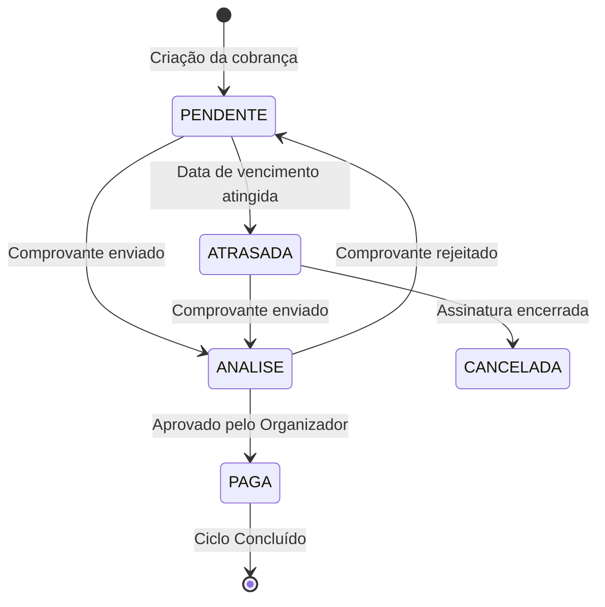
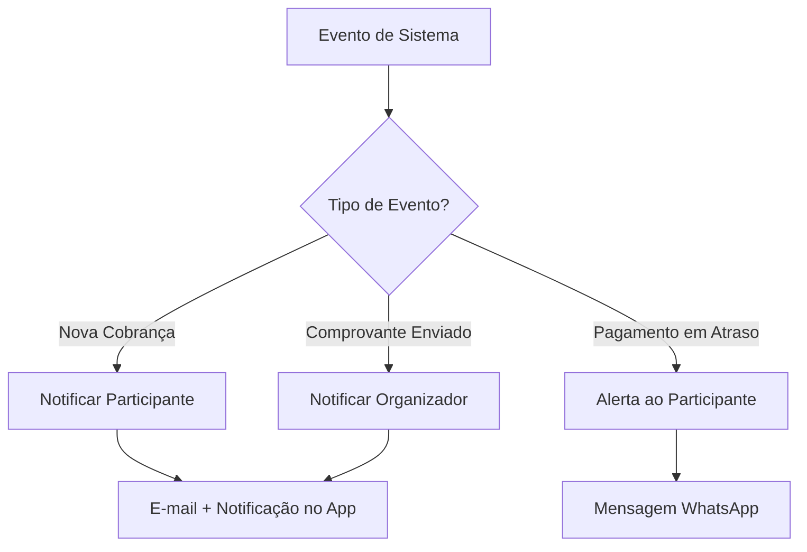

# Arquitetura e Fluxo de Dados

Esta seção apresenta diagramas visuais que ilustram o ciclo de vida das principais entidades da plataforma — como uma cobrança evolui do momento da criação até ao encerramento.

## Ciclo de Vida de uma Cobrança

O diagrama abaixo representa todos os estados possíveis de uma cobrança individual e as transições entre eles.

> **Legenda de termos:** "ANALISE" indica que o comprovante foi submetido e está aguardando validação pelo Organizador. "ATRASADA" indica que a data de vencimento passou sem pagamento registrado.

## Fluxo de Notificações

Este diagrama ilustra como o sistema reage a eventos importantes para manter os participantes informados.

> O sistema identifica o tipo de evento ocorrido e seleciona automaticamente o canal de comunicação mais adequado para notificar o destinatário correto.

