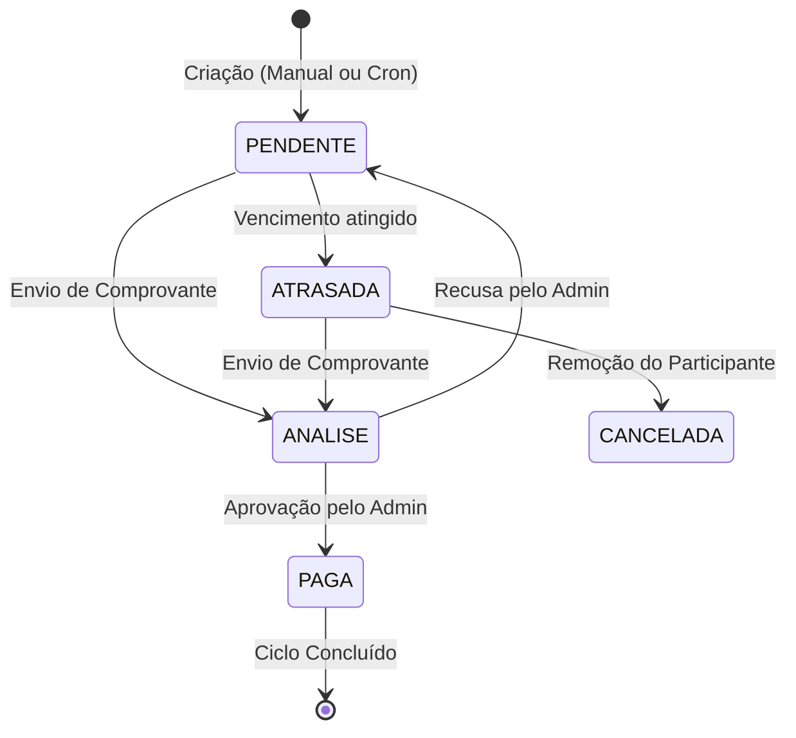
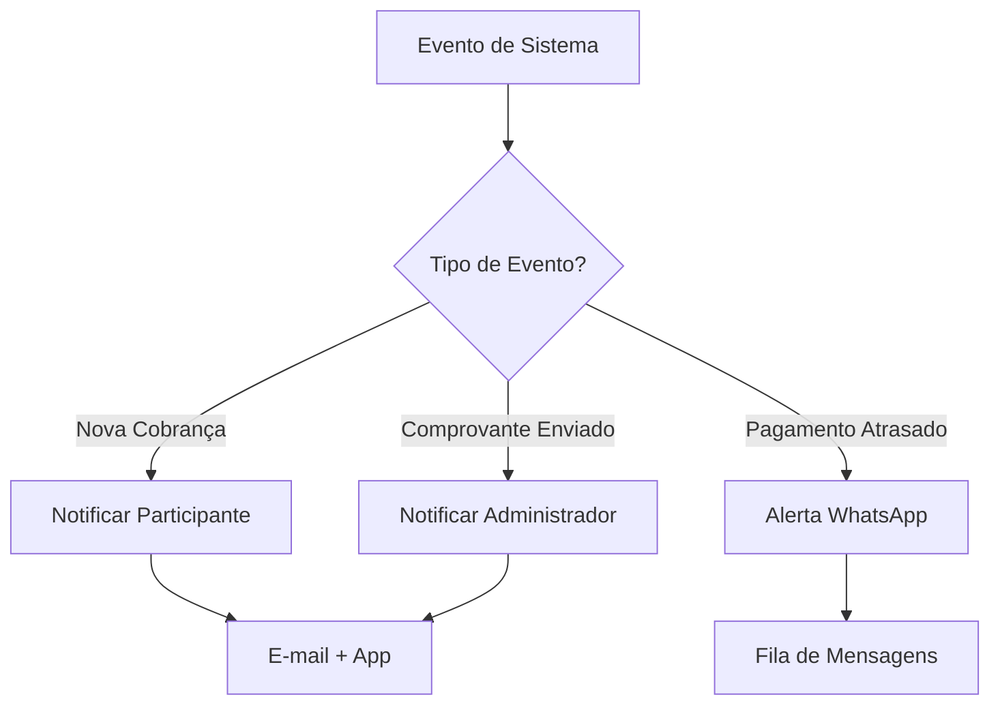

# Arquitetura e Fluxo de Dados

Abaixo está o diagrama de estados da entidade **Cobrança** (Invoice), que é o coração do motor financeiro do StreamShare.

## Fluxo de Notificações

Este diagrama ilustra como o sistema reage a eventos importantes para manter os usuários informados.

