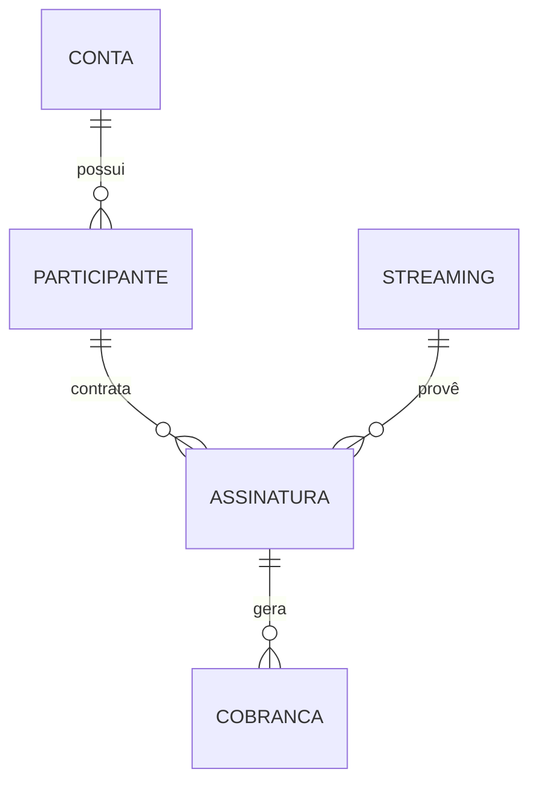

# Documentação Técnica: Sistema de Assinaturas (StreamShare)

Este documento detalha o funcionamento técnico do sistema de assinaturas, desde a criação até a renovação e cancelamento, incluindo a integração com o Mercado Pago.

## 1. Modelo de Dados e Relacionamentos

O sistema baseia-se em duas entidades principais no Prisma:

- **Assinatura (`Assinatura`)**: Representa o vínculo contratual entre um participante e um serviço de streaming.
  - Campos principais: `status`, `frequencia`, `valor`, `dataInicio`, `autoRenovacao`.
- **Cobrança (`Cobranca`)**: Representa um evento financeiro associado a uma assinatura. Uma assinatura possui várias cobranças ao longo do tempo.
  - Campos principais: `periodoInicio`, `periodoFim`, `status` (pago, pendente, atrasado, estornado), `gatewayId`.

## 2. Fluxo de Criação

O processo de criação é centralizado nas Server Actions em `src/actions/assinaturas.ts`.

### Validação (`subscription-validator.ts`)
Antes de criar qualquer registro, o sistema verifica:
1. **Acesso**: Se o streaming pertence à conta logada.
2. **Vagas**: Se há slots disponíveis no streaming (`limiteParticipantes`).
3. **Duplicidade**: Se o participante já possui uma assinatura ativa para aquele streaming.
4. **Datas/Valores**: Se os dados financeiros são válidos.

### Transação de Criação
A criação ocorre dentro de uma transação Prisma para garantir atomicidade:
- **Criação da Assinatura**: O status inicial é definido como `ativa` (se já paga manualmente) ou `pendente`.
- **Geração da Cobrança Inicial**: O `billingService.gerarCobrancaInicial` cria a primeira fatura cobrindo o primeiro período.
- **Notificação**: Um registro é criado na tabela `Notificacao` e uma mensagem é enviada via WhatsApp (se configurado).

---

## 3. Renovação Automática e Ciclo de Vida

A lógica de renovação não depende da interação do usuário, sendo regida por um **Cron Job** (`src/cron/renew-subscriptions.ts`) que roda diariamente.

### Processo de Renovação (`billing-service.ts`)
O `billingService.processarCicloCobranca` executa:

1. **Identificação de Oportunidades**: Assinaturas ativas com renovação habilitada que expiram em menos de 5 dias.
2. **Geração de Nova Cobrança**:
   - Cria um novo registro de `Cobranca` para o próximo período.
   - **Integração Gateway**: Se for renovação via PIX, chama a API do Mercado Pago para gerar o QR Code *antes* de finalizar a transação no banco (para evitar locks longos).
3. **Gestão de Inadimplência**:
   - Cobranças não pagas após o vencimento mudam para `atrasado`.
   - Após 3 dias de atraso, a assinatura é alterada para `suspensa`.

---

## 4. Cancelamento e Estorno

Localizado na função `cancelarAssinatura` em `src/actions/assinaturas.ts`.

### Tipos de Cancelamento
- **Agendado**: Se o usuário pagou pelo mês atual, a assinatura permanece `ativa` mas com `dataCancelamento` preenchida. O Cron Job irá alterá-la para `cancelada` apenas quando o período pago terminar.
- **Imediato com Estorno**: Se solicitado, o sistema tenta realizar um `refundPayment` via API do Mercado Pago. Caso o gateway confirme, a cobrança muda para `estornado` e o acesso é cortado imediatamente.

---

## 5. Integração com Mercado Pago (`src/lib/mercado-pago.ts`)

A integração é dividida em dois fluxos:

### Fluxo de Participantes (Cobranças Individuais)
- **PIX**: `createPixPayment` gera pagamentos dinâmicos com notificação via webhook.
- **Checkout Pro**: `createCheckoutPreference` para pagamentos via cartão.

### Fluxo SaaS (Planos da Plataforma)
- O StreamShare também usa o Mercado Pago para cobrar os seus próprios clientes (donos de contas).
- `createSaaSSubscription` usa o fluxo de `preapproval` do Mercado Pago para assinaturas recorrentes do plano Pro/Business.

---

## 6. Arquivos Chave

| Arquivo | Responsabilidade |
| :--- | :--- |
| `src/actions/assinaturas.ts` | Interface com o Frontend e orquestração de transações. |
| `src/services/billing-service.ts` | Lógica de negócio financeira e renovações. |
| `src/services/subscription-validator.ts` | Validação de regras de negócio (DRY). |
| `src/lib/mercado-pago.ts` | Cliente de integração com a API financeira. |
| `src/cron/renew-subscriptions.ts` | Agendador de tarefas automáticas. |
