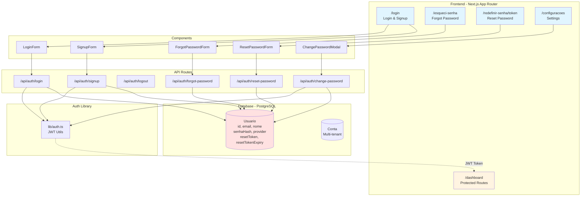
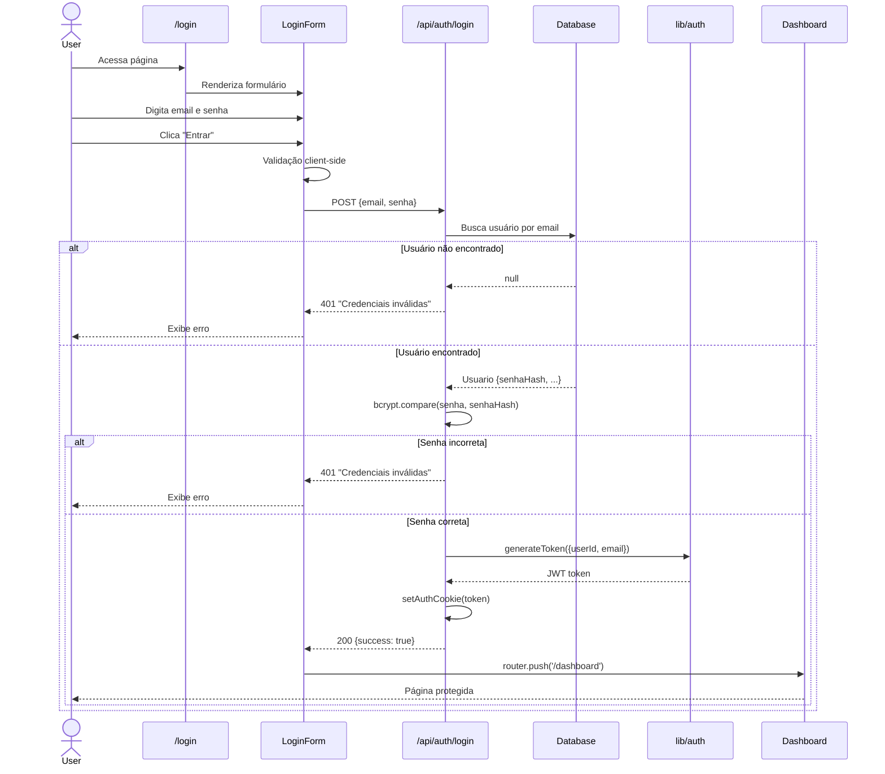
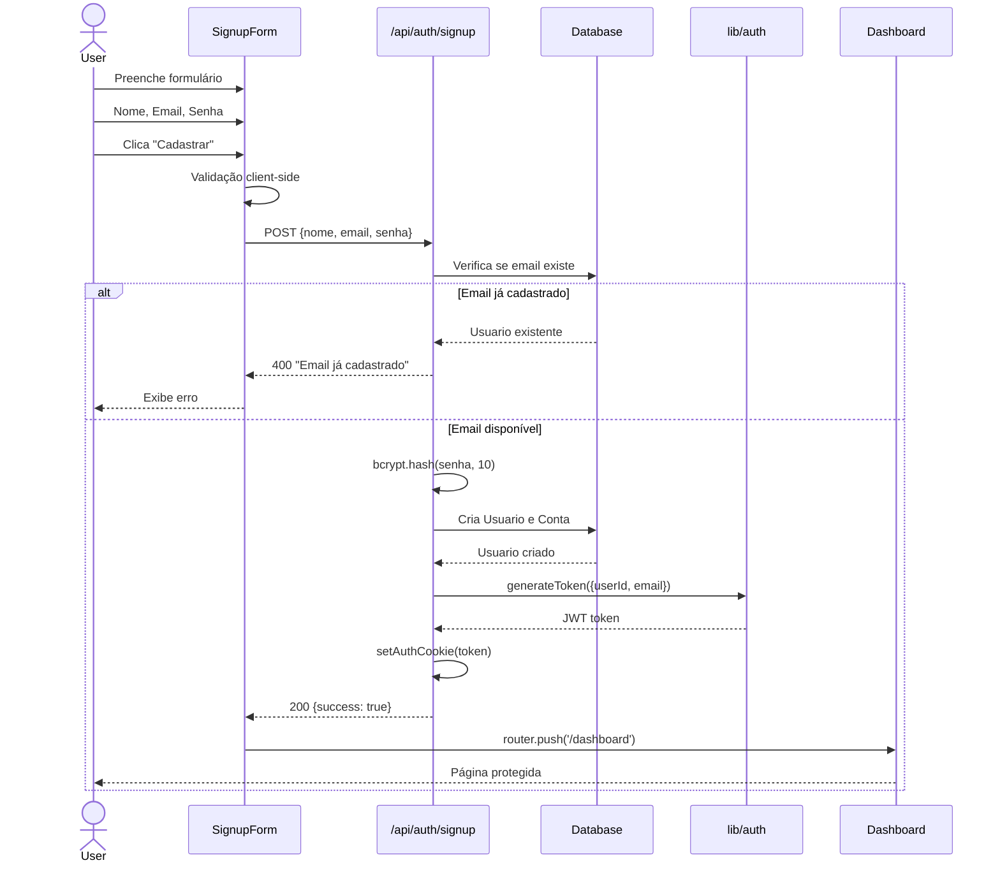
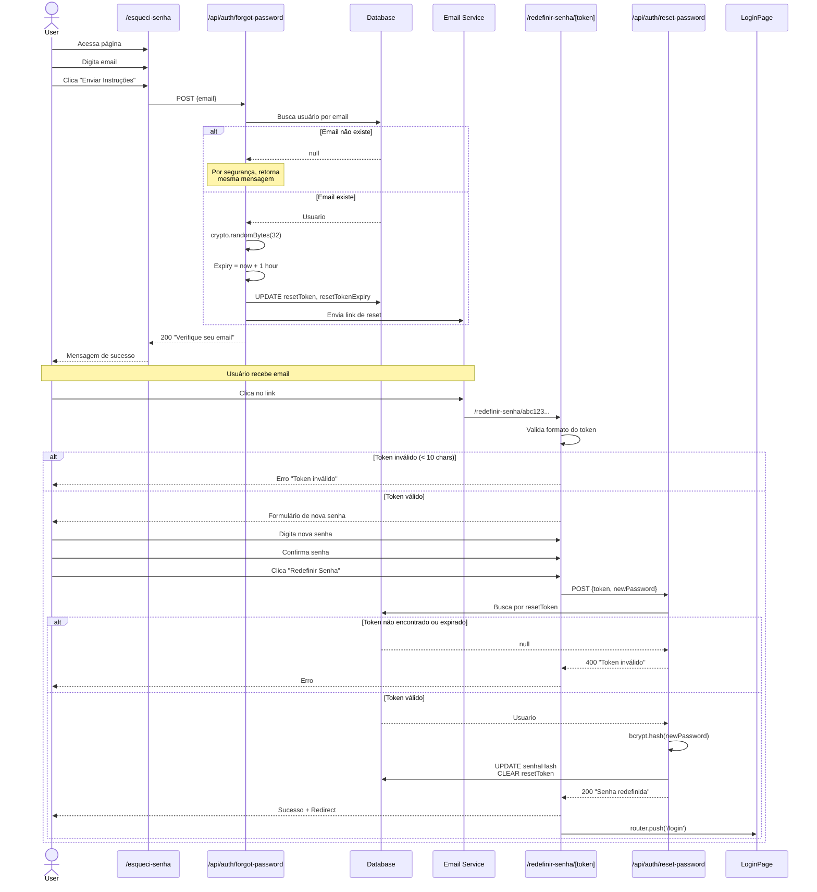
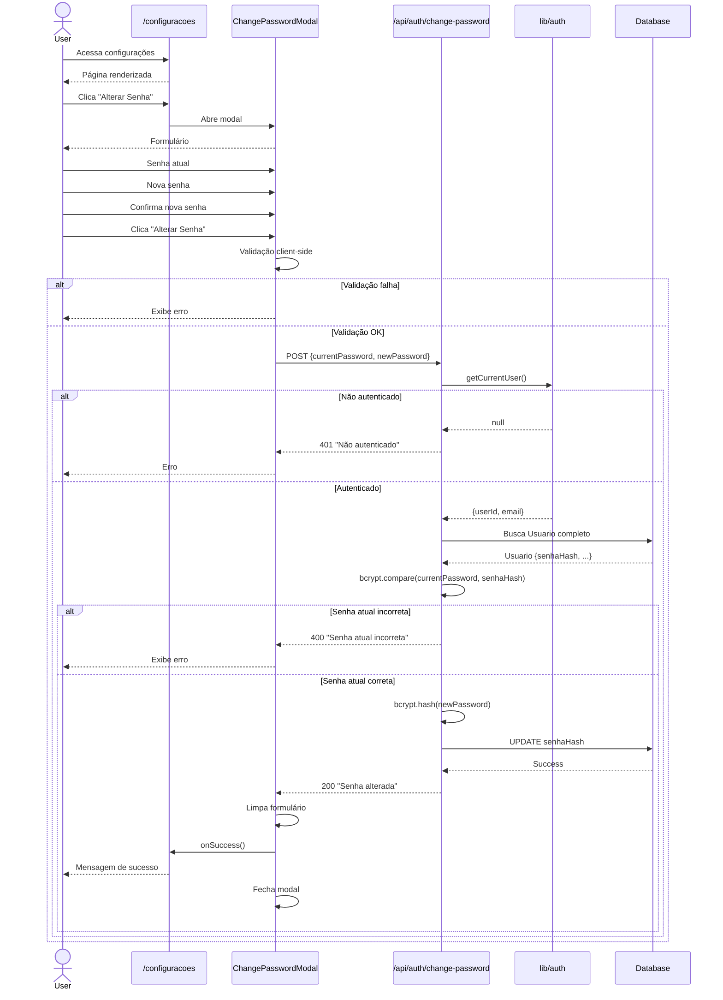
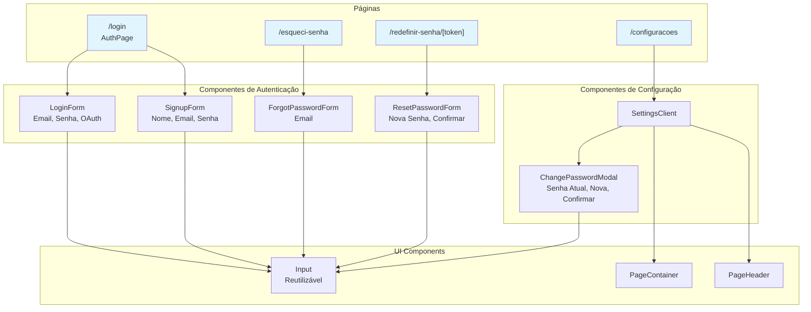
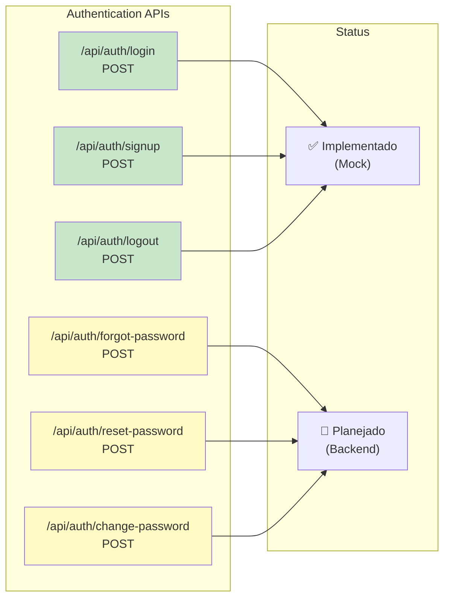
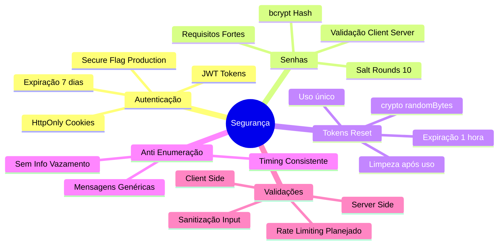
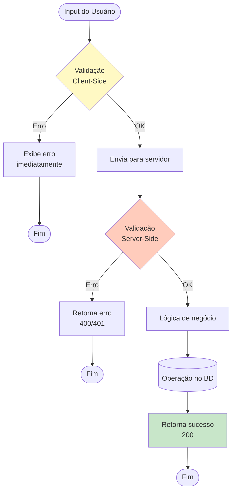

# Sistema de Autenticação e Gerenciamento de Senhas

> Documentação completa do sistema de autenticação do StreamShare, incluindo login, cadastro, recuperação de senha e alteração de senha.

---

## 📑 Índice

- [Visão Geral](#visão-geral)
- [Arquitetura do Sistema](#arquitetura-do-sistema)
- [Fluxos de Autenticação](#fluxos-de-autenticação)
  - [Login](#1-login)
  - [Cadastro](#2-cadastro)
  - [Recuperação de Senha](#3-recuperação-de-senha)
  - [Alteração de Senha](#4-alteração-de-senha)
- [Componentes](#componentes)
- [API Routes](#api-routes)
- [Segurança](#segurança)
- [Validações](#validações)
- [Próximos Passos](#próximos-passos)

---

## Visão Geral

O sistema de autenticação do StreamShare é construído com Next.js 14 (App Router) e utiliza JWT (JSON Web Tokens) para gerenciamento de sessões. O sistema suporta:

- ✅ Autenticação local (email/senha)
- ✅ Cadastro de novos usuários
- ✅ Recuperação de senha via email
- ✅ Alteração de senha para usuários logados
- 🔄 OAuth com Google (planejado)
- 🔄 Autenticação 2FA (planejado)

---

## Arquitetura do Sistema



---

## Fluxos de Autenticação

### 1. Login



**Arquivo**: [LoginForm.tsx](file:///w:/projetos/streamsharev2/apps/web/src/components/auth/LoginForm.tsx)

**Características**:
- Validação de email e senha
- Loading state durante autenticação
- Mensagens de erro contextuais
- Opção "Lembrar-me"
- Link para recuperação de senha
- Botão OAuth com Google

---

### 2. Cadastro



**Arquivo**: [SignupForm.tsx](file:///w:/projetos/streamsharev2/apps/web/src/components/auth/SignupForm.tsx)

**Características**:
- Validação de nome, email e senha
- Verificação de email duplicado
- Criação automática de conta (multi-tenant)
- Login automático após cadastro
- Termos de uso e política de privacidade

---

### 3. Recuperação de Senha



**Arquivos**:
- [ForgotPasswordForm.tsx](file:///w:/projetos/streamsharev2/apps/web/src/components/auth/ForgotPasswordForm.tsx)
- [ResetPasswordForm.tsx](file:///w:/projetos/streamsharev2/apps/web/src/components/auth/ResetPasswordForm.tsx)
- [forgot-password/route.ts](file:///w:/projetos/streamsharev2/apps/web/src/app/api/auth/forgot-password/route.ts)
- [reset-password/route.ts](file:///w:/projetos/streamsharev2/apps/web/src/app/api/auth/reset-password/route.ts)

**Características**:
- Mensagem genérica (anti-enumeração)
- Token único e seguro
- Expiração de 1 hora
- Validação de requisitos de senha
- Redirecionamento automático

---

### 4. Alteração de Senha



**Arquivos**:
- [ChangePasswordModal.tsx](file:///w:/projetos/streamsharev2/apps/web/src/components/modals/ChangePasswordModal.tsx)
- [change-password/route.ts](file:///w:/projetos/streamsharev2/apps/web/src/app/api/auth/change-password/route.ts)
- [SettingsClient.tsx](file:///w:/projetos/streamsharev2/apps/web/src/components/configuracoes/SettingsClient.tsx)

**Características**:
- Requer autenticação (JWT)
- Valida senha atual
- Toggle de visibilidade de senha
- Validação de requisitos
- Nova senha deve ser diferente
- Feedback de sucesso no header

---

## Componentes

### Estrutura de Componentes



### Componentes Principais

| Componente | Localização | Responsabilidade |
|------------|-------------|------------------|
| **LoginForm** | `components/auth/LoginForm.tsx` | Formulário de login com validação |
| **SignupForm** | `components/auth/SignupForm.tsx` | Formulário de cadastro |
| **ForgotPasswordForm** | `components/auth/ForgotPasswordForm.tsx` | Solicitação de reset de senha |
| **ResetPasswordForm** | `components/auth/ResetPasswordForm.tsx` | Redefinição de senha com token |
| **ChangePasswordModal** | `components/modals/ChangePasswordModal.tsx` | Modal de alteração de senha |
| **Input** | `components/ui/Input.tsx` | Input reutilizável com label |

---

## API Routes

### Endpoints Disponíveis



### Detalhes dos Endpoints

#### POST /api/auth/login

**Request**:
```json
{
  "email": "usuario@example.com",
  "senha": "SenhaSegura123"
}
```

**Response** (200):
```json
{
  "success": true
}
```

**Cookies**: `auth-token` (HttpOnly, Secure)

---

#### POST /api/auth/signup

**Request**:
```json
{
  "nome": "João Silva",
  "email": "joao@example.com",
  "senha": "SenhaSegura123"
}
```

**Response** (200):
```json
{
  "success": true
}
```

---

#### POST /api/auth/forgot-password

**Request**:
```json
{
  "email": "usuario@example.com"
}
```

**Response** (200):
```json
{
  "message": "Se o email existir, você receberá instruções para redefinir sua senha."
}
```

> ⚠️ **Segurança**: Sempre retorna sucesso, mesmo se email não existir (previne enumeração de usuários)

---

#### POST /api/auth/reset-password

**Request**:
```json
{
  "token": "abc123def456...",
  "newPassword": "NovaSenhaSegura456"
}
```

**Response** (200):
```json
{
  "message": "Senha redefinida com sucesso!"
}
```

**Errors**:
- `400`: Token inválido ou expirado
- `400`: Senha não atende requisitos

---

#### POST /api/auth/change-password

**Request**:
```json
{
  "currentPassword": "SenhaAtual123",
  "newPassword": "NovaSenha456"
}
```

**Response** (200):
```json
{
  "message": "Senha alterada com sucesso!"
}
```

**Errors**:
- `401`: Não autenticado
- `400`: Senha atual incorreta
- `400`: Nova senha não atende requisitos

**Headers**: Requer `Cookie: auth-token=...`

---

## Segurança

### Medidas Implementadas



### Requisitos de Senha

Todas as senhas devem atender aos seguintes critérios:

- ✅ **Mínimo 8 caracteres**
- ✅ **Pelo menos 1 letra maiúscula** (A-Z)
- ✅ **Pelo menos 1 letra minúscula** (a-z)
- ✅ **Pelo menos 1 número** (0-9)

**Validação Client-Side**:
```typescript
function validatePassword(pwd: string): string | null {
    if (pwd.length < 8) return "Mínimo 8 caracteres";
    if (!/[A-Z]/.test(pwd)) return "Falta letra maiúscula";
    if (!/[a-z]/.test(pwd)) return "Falta letra minúscula";
    if (!/[0-9]/.test(pwd)) return "Falta número";
    return null;
}
```

### JWT Token

**Estrutura**:
```typescript
interface JWTPayload {
    userId: number;
    email: string;
    iat: number;  // Issued at
    exp: number;  // Expiration
}
```

**Configuração**:
- Secret: `process.env.JWT_SECRET`
- Expiração: 7 dias
- Algoritmo: HS256

**Armazenamento**:
- Cookie HttpOnly
- Secure em produção
- SameSite: Lax
- Path: /

---

## Validações

### Fluxo de Validação



### Validações por Campo

| Campo | Client-Side | Server-Side |
|-------|-------------|-------------|
| **Email** | Formato válido | Formato + Existência no BD |
| **Senha** | Requisitos | Requisitos + Hash |
| **Nome** | Não vazio | Não vazio + Sanitização |
| **Token** | Formato | Formato + Validade + Expiração |

---

## Próximos Passos

### Backend Implementation

#### 1. Schema Updates

Adicionar campos ao model `Usuario`:

```prisma
model Usuario {
  // ... campos existentes
  resetToken        String?
  resetTokenExpiry  DateTime?
  // ...
}
```

**Migration**:
```bash
npx prisma migrate dev --name add_password_reset_fields
```

---

#### 2. Implementar forgot-password

```typescript
// app/api/auth/forgot-password/route.ts
import crypto from 'crypto';

export async function POST(request: NextRequest) {
  const { email } = await request.json();
  
  // 1. Buscar usuário
  const user = await prisma.usuario.findUnique({ where: { email } });
  
  if (user) {
    // 2. Gerar token
    const resetToken = crypto.randomBytes(32).toString('hex');
    const resetTokenExpiry = new Date(Date.now() + 3600000); // 1 hora
    
    // 3. Salvar no banco
    await prisma.usuario.update({
      where: { id: user.id },
      data: { resetToken, resetTokenExpiry }
    });
    
    // 4. Enviar email
    await sendPasswordResetEmail(email, resetToken);
  }
  
  // Sempre retorna sucesso (segurança)
  return NextResponse.json({ 
    message: "Se o email existir, você receberá instruções." 
  });
}
```

---

#### 3. Implementar reset-password

```typescript
// app/api/auth/reset-password/route.ts
import bcrypt from 'bcrypt';

export async function POST(request: NextRequest) {
  const { token, newPassword } = await request.json();
  
  // 1. Buscar usuário com token válido
  const user = await prisma.usuario.findFirst({
    where: {
      resetToken: token,
      resetTokenExpiry: { gt: new Date() }
    }
  });
  
  if (!user) {
    return NextResponse.json(
      { error: "Token inválido ou expirado" },
      { status: 400 }
    );
  }
  
  // 2. Hash da nova senha
  const senhaHash = await bcrypt.hash(newPassword, 10);
  
  // 3. Atualizar senha e limpar token
  await prisma.usuario.update({
    where: { id: user.id },
    data: {
      senhaHash,
      resetToken: null,
      resetTokenExpiry: null
    }
  });
  
  return NextResponse.json({ 
    message: "Senha redefinida com sucesso!" 
  });
}
```

---

#### 4. Implementar change-password

```typescript
// app/api/auth/change-password/route.ts
import bcrypt from 'bcrypt';
import { getCurrentUser } from '@/lib/auth';

export async function POST(request: NextRequest) {
  // 1. Verificar autenticação
  const currentUser = await getCurrentUser();
  if (!currentUser) {
    return NextResponse.json(
      { error: "Não autenticado" },
      { status: 401 }
    );
  }
  
  const { currentPassword, newPassword } = await request.json();
  
  // 2. Buscar usuário completo
  const user = await prisma.usuario.findUnique({
    where: { id: currentUser.userId }
  });
  
  // 3. Validar senha atual
  const isValid = await bcrypt.compare(currentPassword, user.senhaHash);
  if (!isValid) {
    return NextResponse.json(
      { error: "Senha atual incorreta" },
      { status: 400 }
    );
  }
  
  // 4. Hash e atualizar
  const senhaHash = await bcrypt.hash(newPassword, 10);
  await prisma.usuario.update({
    where: { id: user.id },
    data: { senhaHash }
  });
  
  return NextResponse.json({ 
    message: "Senha alterada com sucesso!" 
  });
}
```

---

#### 5. Integração de Email

**Opções de Serviço**:
- [Resend](https://resend.com) (Recomendado)
- SendGrid
- AWS SES
- Mailgun

**Template de Email**:
```typescript
// lib/email.ts
import { Resend } from 'resend';

const resend = new Resend(process.env.RESEND_API_KEY);

export async function sendPasswordResetEmail(
  email: string, 
  token: string
) {
  const resetUrl = `${process.env.NEXT_PUBLIC_URL}/redefinir-senha/${token}`;
  
  await resend.emails.send({
    from: 'StreamShare <atendimento@streamshare.com.br>',
    to: email,
    subject: 'Redefinir sua senha - StreamShare',
    html: `
      <h1>Redefinir Senha</h1>
      <p>Clique no link abaixo para redefinir sua senha:</p>
      <a href="${resetUrl}">${resetUrl}</a>
      <p>Este link expira em 1 hora.</p>
      <p>Se você não solicitou isso, ignore este email.</p>
    `
  });
}
```

---

### Melhorias Futuras

- [ ] **Rate Limiting**: Prevenir ataques de força bruta
- [ ] **OAuth Google**: Autenticação social
- [ ] **2FA**: Autenticação de dois fatores
- [ ] **Logs de Auditoria**: Rastrear tentativas de login
- [ ] **Sessões Múltiplas**: Gerenciar dispositivos
- [ ] **Email Verification**: Verificar email no cadastro
- [ ] **Password Strength Meter**: Indicador visual
- [ ] **Biometria**: Suporte para WebAuthn

---

## 📚 Referências

- [Next.js Authentication](https://nextjs.org/docs/app/building-your-application/authentication)
- [JWT Best Practices](https://tools.ietf.org/html/rfc8725)
- [OWASP Password Guidelines](https://cheatsheetseries.owasp.org/cheatsheets/Authentication_Cheat_Sheet.html)
- [bcrypt Documentation](https://github.com/kelektiv/node.bcrypt.js)

---

## 🤝 Contribuindo

Para contribuir com melhorias no sistema de autenticação:

1. Siga os padrões de código estabelecidos
2. Adicione testes para novas funcionalidades
3. Atualize esta documentação
4. Considere implicações de segurança

---

**Última atualização**: 2026-01-14  
**Versão**: 1.0.0  
**Status**: ✅ Frontend Completo | 🔄 Backend em Desenvolvimento
