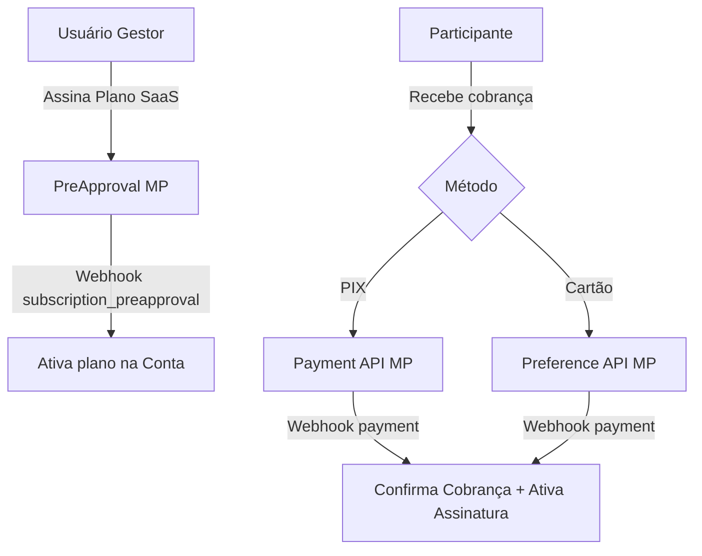
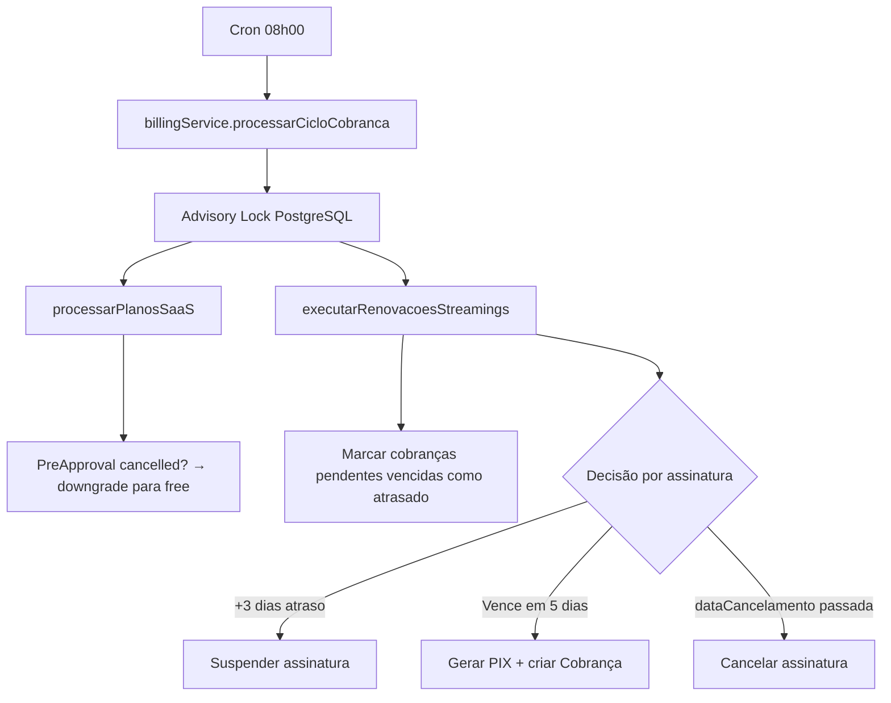

# 💳 Integração Mercado Pago — Técnico Completo
> Revisão de Fluxos, ACID, SOLID, Segurança, Bugs e Variáveis de Ambiente · v2.0 · Fev/2026

---

## 1. Visão Geral da Arquitetura

O sistema possui **dois fluxos de pagamento distintos e independentes**:



| Fluxo | API MP | Arquivo Principal |
|-------|--------|-------------------|
| **SaaS** — Plano Pro/Business | `PreApproval` | `actions/planos.ts` + `lib/mercado-pago.ts` |
| **Streaming** — Cobrança de Participante | `Payment` (PIX) + `Preference` (Cartão) | `services/billing-service.ts` + `actions/cobrancas.ts` |
| **Webhook** | Ambos | `app/api/webhooks/mercado-pago/route.ts` |
| **Estorno** | `Payment Refunds` | `actions/payments.ts` |

---

## 2. Análise de Fluxos

### 2.1 Fluxo SaaS (Planos Pro/Business)

```
[/planos] → createCheckoutSession() → createSaaSSubscription(mpPlanId, email, external_ref)
    → MP PreApproval.create() → retorna init_point
    → PlanCheckoutClient redireciona para init_point com delay 1.5s (UX)
    → Usuário paga no MP → MP dispara webhook subscription_preapproval
    → route.ts: lê externalRef (saas_{contaId}_{plano}) → atualiza conta.plano + conta.gatewaySubscriptionId
```

**Pontos fortes:**
- `external_reference` com formato `saas_{contaId}_{plano}` — rastreável e validado
- Cancelamento e reativação implementados (`cancelSaaSSubscription` / `reactivateSaaSSubscription`)
- Cron `billingService.processarPlanosSaaS()` verifica status no MP e faz downgrade automático

### 2.2 Fluxo Streaming (Cobrança de Participante)

**Geração PIX (Automático via Cron ou Manual):**
```
billingService.executarRenovacoesStreamings()
    → evaluateSubscriptionRenewal() → checkRenewalOpportunity()
    → [PRE-GENERATE] createPixPayment() → MP Payment.create(pix)   ← fora da tx
    → [TRANSACTION]  cobranca.create({ gatewayId, pixQrCode, pixCopiaECola, status: "pendente" })
```

**Confirmação via Webhook:**
```
MP → POST /api/webhooks/mercado-pago?type=payment&data.id={id}
    → mpPayment.get(id) → verifica status === "approved"
    → [IDEMPOTENCY]  cobranca.status já é "pago"? → skip
    → [TRANSACTION]  cobranca.update({ status: "pago", dataPagamento })
                     notificacao.create(...)
                     billingService.avaliarAtivacaoAposPagamento() → ativa/reativa assinatura
```

**Pontos fortes:**
- Advisory lock no PostgreSQL evita execução paralela do cron (idempotência distribuída)
- Verificação de duplicidade antes de criar cobrança (`findFirst` por `assinaturaId + periodoInicio`)
- Padrão *reserve-then-commit*: PIX criado no MP antes de abrir a transação DB
- Lógica de suspensão após 3 dias de atraso
- Reativação automática após pagamento confirmado

---

## 3. Segurança (Webhook)

### 3.1 Validação HMAC-SHA256

```typescript
// lib/mercado-pago.ts → validateMPSignature()
const manifest = `id:${dataId};request-id:${xRequestId};ts:${ts};`;
const hmac = crypto.createHmac('sha256', secret);
hmac.update(manifest);
const digest = hmac.digest('hex');
return digest === hash; // ✅ formato correto conforme documentação MP
```

### 3.2 Comportamento por Ambiente

| Cenário | Dev | Produção |
|---------|-----|----------|
| Com `x-signature` + `x-request-id` | Valida HMAC | Valida HMAC |
| Sem headers de assinatura | **Permite** (200) | **Bloqueia** (401) |
| HMAC inválido | Bloqueia (401) | Bloqueia (401) |
| `externalRef` inválido no SaaS | Log + 200 | Log + 200 |

> [!WARNING]
> `isMercadoPagoIP()` em `mercadoPagoAdapter.security` **sempre retorna `true`**. A validação de IP por CIDR não está implementada. Em produção, a segurança baseia-se exclusivamente no HMAC (aceitável em ambientes serverless/edge onde o IP do proxy pode variar).

---

## 4. Análise ACID

### 4.1 Garantias implementadas ✅

| Operação | Transação | Garantia |
|----------|-----------|----------|
| Webhook `payment` — cobrança + notificação + ativa assinatura | `prisma.$transaction()` | Atômico |
| Webhook `subscription_preapproval` — conta + notificação | `prisma.$transaction()` | Atômico |
| `confirmarPagamento()` manual | `prisma.$transaction()` | Atômico |
| `cancelarCobranca()` — cancela + notificação | `prisma.$transaction()` | Atômico |
| Cron billing — lock + renovações + suspensões | `$transaction()` + advisory lock | Atômico + Isolado |
| `getPaymentsData()` — agregados de stats | `$transaction([...])` | Leitura consistente |
| Geração PIX no cron | Pre-generate → `$transaction` | ACID (reserve-then-commit) |

### 4.2 Risco remanescente ❌

#### **ACID-1: `refundPaymentAction` não é totalmente atômico**
```typescript
// actions/payments.ts
const result = await refundPayment(paymentId);  // Chama MP (externo)
if (result.success) {
    await prisma.cobranca.updateMany(...);        // DB atualizado separadamente
}
```
**Risco:** Se o MP confirmar o estorno mas o `updateMany` falhar, o banco fica dessincronizado com o gateway.

**Mitigação recomendada:** Aguardar o webhook `payment.updated` com status `refunded` para confirmar atomicamente no banco.

---

## 5. Análise SOLID

### 5.1 Single Responsibility (SRP)

| Arquivo | Responsabilidade | Avaliação |
|---------|-----------------|-----------|
| `lib/mercado-pago.ts` | SDK/adaptador MP — único ponto de contato | ✅ |
| `services/billing-service.ts` | Ciclo de cobrança e renovação | ✅ (IO externo separado da tx) |
| `actions/planos.ts` | Orquestra planos SaaS | ✅ |
| `actions/payments.ts` | Estorno + dados financeiros | ⚠️ duas responsabilidades |
| `app/api/webhooks/mercado-pago/route.ts` | Roteamento de webhooks | ⚠️ lógica inline |

### 5.2 Open/Closed (OCP) ⚠️

O roteamento via `if/else if` no webhook não é extensível. Para adicionar novos tipos de eventos, o arquivo precisa ser modificado.

**Pattern recomendado para evolução futura:**
```typescript
const handlers: Record<string, WebhookHandler> = {
    'payment': handlePaymentEvent,
    'subscription_preapproval': handlePreApprovalEvent,
};
await handlers[type]?.(dataId, prisma);
```

### 5.3 Liskov Substitution (LSP) ✅
`mercadoPagoAdapter` serve como interface unificada e substituível.

### 5.4 Interface Segregation (ISP) ✅
`CreatePreferenceData` bem definida. Tipos de subscription separados de tipos de payment.

### 5.5 Dependency Inversion (DIP) ⚠️
`billing-service.ts` importa `createPixPayment` diretamente do `lib/mercado-pago.ts`. Injeção de dependência facilitaria testes unitários.

---

## 6. Bugs Conhecidos e Status de Correção

### 🔴 Bugs Críticos

| # | Arquivo | Problema | Status |
|---|---------|---------|--------|
| B1 | `lib/mercado-pago.ts` | `isMercadoPagoIP()` sempre retorna `true` | ⚠️ Pendente (decisão arquitetural) |
| B2 | `billing-service.ts` | PIX criado dentro de `$transaction` | ✅ Corrigido |
| B3 | `actions/payments.ts` | Estorno sem atomicidade DB | ⚠️ Pendente (requer webhook de estorno) |
| B4 | `actions/cobrancas.ts` | Chamava `billingService.processarRenovacoes()` inexistente | ✅ Corrigido |

### 🟡 Bugs Importantes

| # | Arquivo | Problema | Status |
|---|---------|---------|--------|
| B5 | `webhooks/route.ts` | Webhook SaaS sem `$transaction` | ✅ Corrigido |
| B6 | `config/plans.ts` | `mpPlanId` via `NEXT_PUBLIC_*` | ✅ Corrigido |
| B7 | `webhooks/route.ts` | Pagamentos não-aprovados sem log | ✅ Corrigido |
| B8 | `.env` | `NEXT_PUBLIC_URL` ausente | ✅ Corrigido |
| B9 | `webhooks/route.ts` | Sem idempotência no webhook | ✅ Corrigido |

---

## 7. Variáveis de Ambiente

### 7.1 Referência Completa

```env
# Autenticação SDK (server-only)
MERCADOPAGO_ACCESS_TOKEN=APP_USR-...

# Segurança de Webhooks
MERCADOPAGO_WEBHOOK_SECRET=...
MERCADOPAGO_WEBHOOK_URL=https://seudominio.com.br/api/webhooks/mercado-pago

# Planos SaaS — IDs do PreApproval (server-only, nunca NEXT_PUBLIC_!)
MERCADOPAGO_PLAN_PRO=2c938084...
MERCADOPAGO_PLAN_BUSINESS=2c938084...

# URL do app — usada nas back_urls do Preference/PreApproval (obrigatório!)
NEXT_PUBLIC_URL=https://seudominio.com.br

# Cron — protege /api/cron/billing
CRON_SECRET=senha-forte-aqui
```

### 7.2 Onde cada variável é consumida

| Variável | Arquivo | Para quê |
|----------|---------|---------|
| `MERCADOPAGO_ACCESS_TOKEN` | `lib/mercado-pago.ts` | Autenticação do SDK MercadoPagoConfig |
| `MERCADOPAGO_WEBHOOK_SECRET` | `lib/mercado-pago.ts` | Validação HMAC-SHA256 |
| `MERCADOPAGO_WEBHOOK_URL` | `lib/mercado-pago.ts` | `notification_url` nos pagamentos |
| `MERCADOPAGO_PLAN_PRO` | `config/plans.ts` | ID do plano Pro para PreApproval |
| `MERCADOPAGO_PLAN_BUSINESS` | `config/plans.ts` | ID do plano Business para PreApproval |
| `NEXT_PUBLIC_URL` | `lib/mercado-pago.ts` | `back_urls` (sucesso/erro/pending) |
| `CRON_SECRET` | `app/api/cron/billing/route.ts` | Autorização Bearer do cron externo |

---

## 8. Schema — Campos de Gateway

```
model Conta {
  gatewayCustomerId         String?  → (reservado — MP não exige para PreApproval)
  gatewaySubscriptionId     String?  → ID do PreApproval MP (SaaS)
  gatewaySubscriptionStatus String?  → "authorized" | "cancelled" | "paused"
  gatewayCancelAtPeriodEnd  Boolean  → flag de cancelamento no próximo ciclo
}

model Cobranca {
  gatewayId            String?  → ID do Payment MP (PIX ou Cartão)
  gatewayTransactionId String?  → (reservado para uso futuro)
  gatewayProvider      String?  → (reservado — ex: "mercadopago")
  pixQrCode            String?  → Base64 do QR Code gerado pelo MP
  pixCopiaECola        String?  → String copia-e-cola Pix Copia e Cola
  metodoPagamento      Enum?    → PIX | CREDIT_CARD
}
```

> [!NOTE]
> `gatewayCustomerId` nunca é preenchido. O Mercado Pago identifica o pagador pelo `payer_email` nos PreApprovals — não há necessidade de Customer ID separado nesta versão.

---

## 9. Ciclo de Faturamento Automático

O cron roda diariamente via `GET /api/cron/billing` (protegido por `CRON_SECRET`):



---

## 10. Referências

| Recurso | Link |
|---------|------|
| MP Webhooks | [developers.mercadopago.com](https://developers.mercadopago.com/pt/guides/notifications/webhooks/introduction) |
| MP PreApproval (Assinaturas) | [developers.mercadopago.com](https://developers.mercadopago.com/pt/guides/subscriptions/integration-configuration/subscriptions) |
| MP PIX | [developers.mercadopago.com](https://developers.mercadopago.com/pt/guides/online-payments/checkout-api/other-payment-methods/brazil) |
| Validação HMAC | [developers.mercadopago.com](https://developers.mercadopago.com/pt/guides/notifications/webhooks/webhooks-notifications) |
| SDK Node.js | [github.com/mercadopago/sdk-nodejs](https://github.com/mercadopago/sdk-nodejs) |
