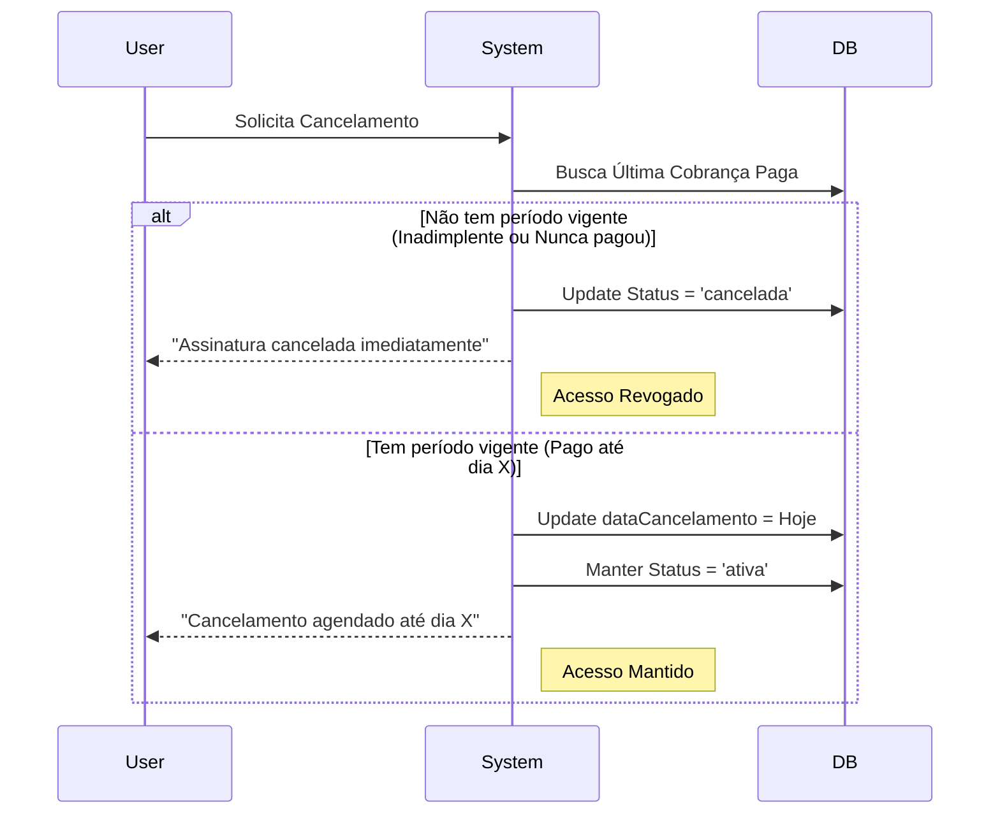

# Regras de Negócio: Cobranças e Assinaturas

Este documento detalha as regras de negócio implementadas para o ciclo de vida das assinaturas, geração de cobranças e cancelamento.

## 1. Fluxograma de Renovação (Billing Service)

O serviço de cobrança (`billing-service.ts`) executa a seguinte lógica para cada assinatura ativa:

```mermaid
flowchart TD
    Start[Início do Processo] --> Fetch[Buscar Assinaturas 'Ativas']
    Fetch --> Loop{Para cada Assinatura}
    
    Loop --> CheckCancel{Possui DataCancelamento?}
    
    %% Fluxo de Cancelamento Agendado
    CheckCancel -- SIM --> CheckPaid[Período Pago acabou?]
    CheckPaid -- SIM (Hj > Fim) --> Finalize[Mudar Status para 'Cancelada']
    Finalize --> NotifyEnd[Notificar Encerramento]
    CheckPaid -- NÃO --> Skip1[Ignorar (Ainda vigente)]
    
    %% Fluxo de Renovação Normal
    CheckCancel -- NÃO --> CheckDue[Está a <= 5 dias do vencimento?]
    
    CheckDue -- NÃO --> Skip2[Ignorar (Ainda não venceu)]
    CheckDue -- SIM --> CalcDate[Calcular Próximo Vencimento]
    
    subgraph "Lógica de Datas (Drift Prevention)"
        CalcDate --> Anchor{Tem Data Anchor?}
        Anchor -- SIM --> Snap[Ajustar dia p/ Data Original]
        Anchor -- NÃO --> AddMonth[AddMonths padrão]
    end
    
    Snap --> Idempotency{Já existe cobrança p/ esta data?}
    AddMonth --> Idempotency
    
    Idempotency -- SIM --> Skip3[Ignorar (Duplicidade)]
    Idempotency -- NÃO --> Create[Criar Cobrança 'Pendente']
    
    Create --> AutoPay{Cobrança Automática?}
    AutoPay -- SIM --> MarkPaid[Marcar como 'Paga']
    AutoPay -- NÃO --> EndLoop
    MarkPaid --> EndLoop
    
    Finalize --> EndLoop
    Skip1 --> EndLoop
    Skip2 --> EndLoop
    Skip3 --> EndLoop
    
    EndLoop --> Transaction[Commit Transação Unificada]
```

## 2. Lógica de Datas e "Drift" (Deriva)

Para evitar que a data de vencimento "ande" ao longo dos meses (ex: 31/01 -> 28/02 -> 28/03), implementamos uma lógica de **Data Âncora**.

### O Problema
Simplesmente adicionar 1 mês à data anterior causa deriva irreversível quando passamos por meses mais curtos.
- Jan 31 + 1 mês = Fev 28
- Fev 28 + 1 mês = Mar 28 (Perdeu-se 3 dias)

### A Solução (Anchor Date)
Toda renovação usa a `dataInicio` original da assinatura como âncora.
1. Calculamos o mês alvo (ex: Março).
2. Tentamos forçar o dia para o dia da `dataInicio` (ex: 31).
3. Se o mês alvo não tem esse dia (ex: Fev tem 28), usamos o último dia do mês.
4. Se o mês alvo TEM esse dia, usamos o dia original.

**Exemplo Prático (Assinatura iniciada em 31/01):**
- **Renovação de Fev**: Mês alvo Fev. Dia 31 não existe. Ajusta para **28/02** (ou 29).
- **Renovação de Mar**: Mês alvo Mar. Dia 31 existe. Ajusta para **31/03**. -> **Recuperou a data correta!**

## 3. Fluxo de Cancelamento (Churn)



## 4. Idempotência e Concorrência

Para evitar cobranças duplicadas (ex: Cron rodando 2x, ou clique duplo no botão de renovar manual), utilizamos uma chave composta lógica.

- **Chave de Unicidade**: `assinaturaId` + `periodoInicio`.
- Antes de criar qualquer cobrança, o sistema faz uma consulta `findFirst` buscando exatamente essa combinação.
- Se encontrar, o processo é abortado silenciosamente (log de warning), garantindo que nunca haverá duas cobranças para o mesmo mês de referência.

## 5. Regras de "Catch-up" (Recuperação)

O sistema permite processar renovações atrasadas ("Catch-up"), mas com proteções:

- **Loop Único**: Em cada execução do processo de cobrança, ele gera **apenas uma** nova cobrança por assinatura, mesmo que ela esteja atrasada há 3 meses.
- **Efeito**: Se uma assinatura está 3 meses atrasada, levará 3 execuções do Cron (3 dias, se rodar diário) para gerar as 3 cobranças pendentes, ou uma execução manual forçada. Isso evita loops infinitos e picos de processamento.

---

## Tabelas de Status

| Status | Descrição | Acesso | Gera Cobrança? |
| :--- | :--- | :--- | :--- |
| `ativa` | Assinatura regular vigente. | SIM | SIM |
| `ativa` (c/ dataCancelamento) | Cancelamento solicitado ("Cancelamento Agendado"). | SIM | NÃO |
| `suspensa` | Pagamento pendente/atrasado. | NÃO | NÃO |
| `cancelada` | Vínculo encerrado definitivamente. | NÃO | NÃO |
