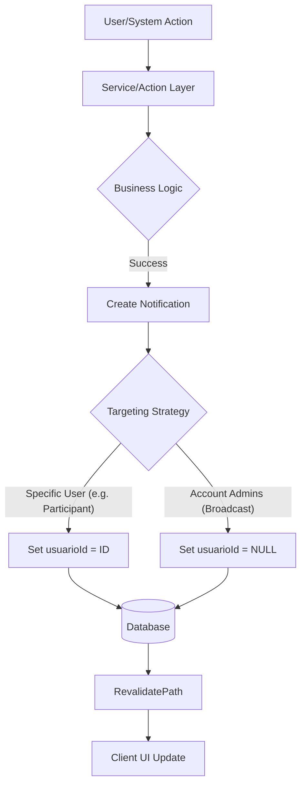
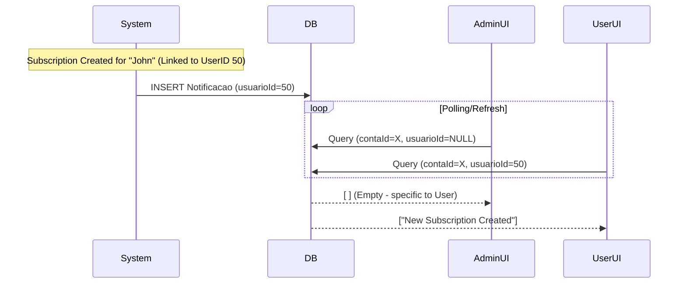

# Notification System: The Definitive Wiki & Guide

> **Status**: ✅ Fully Implemented  
> **Last Updated**: 2026-02-10  
> **Version**: 2.0 (Wiki Edition)

---

## 📚 Table of Contents

1.  [**Part 1: The Wiki (System Reference)**](#part-1-the-wiki-system-reference)
    *   [Architecture & Data Model](#architecture--data-model)
    *   [Targeting Strategy (User vs. Account)](#targeting-strategy-user-vs-account)
    *   [Notification Types Dictionary](#notification-types-dictionary-metadata-schema)
2.  [**Part 2: Developer Guide**](#part-2-developer-guide)
    *   [How to Implement Notifications](#how-to-implement-notifications)
    *   [Best Practices](#best-practices)
    *   [Performance & Security](#performance--security)
3.  [**Part 3: User Guide & Use Cases**](#part-3-user-guide--use-cases)
    *   [User Flows](#user-flows)
    *   [Real World Scenarios](#real-world-scenarios)
4.  [**Part 4: Operations Manual**](#part-4-operations-manual)
    *   [Troubleshooting](#troubleshooting)
    *   [Maintenance & Cleanup](#maintenance--cleanup)

---

# Part 1: The Wiki (System Reference)

## Architecture & Data Model

The notification system acts as the central nervous system for user feedback, ensuring admins and participants are aware of critical events like subscription renewals, payments, and account changes.

### Database Schema (`Notificacao`)

| Field | Type | Description |
| :--- | :--- | :--- |
| `id` | `Int` | Primary Key |
| `contaId` | `Int` | **Tenant Isolation**. All notifications belong to a specific Account. |
| `usuarioId` | `Int?` | **Targeting**. If `null`, it's an Account-wide alert (Admins). If set, it's specific to that User. |
| `tipo` | `Enum` | The classification of the event (e.g., `assinatura_criada`). |
| `titulo` | `String` | Short, bold headline. |
| `descricao` | `String?` | Detailed context. |
| `entidadeId`| `Int?` | ID of the subject entity (Subscription ID, Participant ID, etc.). |
| `metadata` | `Json?` | Flexible payload for extra data (links, counts, snapshots). |
| `lida` | `Boolean` | Read/Unread status. |
| `createdAt` | `DateTime` | Timestamp. |

### Visual Architecture



## Targeting Strategy: User vs. Account

The system intelligently routes notifications based on who *needs* to know. This is a critical distinction for a multi-tenant system with shared accounts.

### 1. Account Level (Broadcast)
*   **Trigger**: `usuarioId = null`
*   **Audience**: All Administrators and Owners of the `Conta`.
*   **Philosophy**: "Something happened in the account that management should know."
*   **Examples**:
    *   A new group was created.
    *   A global setting was changed.
    *   A new billing plan was selected for the account.

### 2. User Level (Direct)
*   **Trigger**: `usuarioId = {id}`
*   **Audience**: A specific System User (usually a Participant linked to a login).
*   **Philosophy**: "Something happened to YOU or YOUR assets."
*   **Examples**:
    *   Your subscription was renewed.
    *   Your payment is overdue.
    *   Your access was revoked.

#### Sequence Diagram: Routing Logic



## Notification Types Dictionary (Metadata Schema)

This section defines the contract for `metadata` for each notification type.

### 💰 Subscription & Billing

| Type | Description | Metadata Schema |
| :--- | :--- | :--- |
| `assinatura_criada` | New subscription active. | `{ totalAssinaturas?: number, totalParticipantes?: number }` (For bulk) |
| `assinatura_renovada` | Recurring payment processed. | `{ valor: number, proximoVencimento: string }` |
| `assinatura_cancelada` | Sub cancelled/scheduled. | `{ motivo?: string, agendado: boolean }` |
| `cobranca_gerada` | New charge pending. | `{ valor: number, vencimento: string, linkPagamento?: string }` |
| `cobranca_confirmada` | Payment received. | `{ valor: number, dataPagamento: string }` |

### 👥 Participant Management

| Type | Description | Metadata Schema |
| :--- | :--- | :--- |
| `participante_criado` | New person added. | `{ whatsapp?: string, email?: string }` |
| `participante_editado` | Details updated. | `{ camposAlterados: string[] }` |
| `participante_excluido` | Person removed. | `{ nomeBackup: string }` |

### 📺 Streaming & Groups

| Type | Description | Metadata Schema |
| :--- | :--- | :--- |
| `streaming_criado` | Service added. | `{ valor: number, vagas: number }` |
| `streaming_editado` | Service updated. | `{ mudouSenha: boolean }` |
| `grupo_criado` | Group created. | `{ totalStreamings: number, linkConvite: string }` |

---

# Part 2: Developer Guide

## How to Implement Notifications

### 1. Identify the Trigger
Is this a *Success* event? (Notifications should never fire on failure/rollback).
Is it *Account-wide* or *User-specific*?

### 2. Call the Helper
Use `criarNotificacao` from `@/actions/notificacoes`.

**Example: User-Targeted Notification**
```typescript
import { criarNotificacao } from "@/actions/notificacoes";

await criarNotificacao({
  tipo: "assinatura_renovada",
  titulo: "Assinatura Renovada",
  descricao: `O período de ${streaming.nome} foi renovado.`,
  contaId: context.contaId,
  // TARGETING LOGIC
  usuarioId: participante.userId, 
  entidadeId: assinatura.id,
  metadata: {
    valor: 25.90,
    proximoVencimento: "2026-03-10"
  }
});
```

**Example: Account-Broadcast Notification**
```typescript
await criarNotificacao({
  tipo: "grupo_criado",
  titulo: "Novo Grupo Criado",
  descricao: `Grupo "Família" criado com 3 serviços.`,
  contaId: context.contaId,
  usuarioId: null, // Broadcast
  metadata: { linkConvite: "abc-123" }
});
```

### 3. Frontend Consumption
The frontend `getNotificacoes` action automatically handles the targeting logic:
```typescript
// Internal logic of getNotificacoes
const where = {
  contaId,
  OR: [
    { usuarioId: session.user.id }, // My stuff
    { usuarioId: null }             // Admin stuff
  ]
};
```

## Best Practices

### ✅ DO
*   **Include Context**: "Subscription Created" is bad. "Netflix Subscription created for John" is good.
*   **Use Metadata**: Put IDs, Links, and raw numbers in metadata. Use Description for human text.
*   **Batch Operations**: If creating 50 imports, send **one** summary notification.

### ❌ DON'T
*   **Spam**: Do not notify on every minor field edit unless critical.
*   **Leak Secrets**: Never put passwords or tokens in metadata.
*   **Block Main Thread**: Await notifications *after* the main return if possible, or use `void` (fire and forget) if using a queue system (currently we await to ensure consistency).

## Performance & Security

### Database Indexing
The table uses composite indexes to ensure the widget loads instantly:
*   `[contaId, createdAt]` - For the main feed history.
*   `[contaId, lida]` - For the unread badge counter.

### Auto-Cleanup
A background job (Cron) runs nightly to delete notifications older than **30 days**. This keeps the table size managed and queries fast.

### Access Control
Notifications are strictly scoped to `contaId`. A user from Account A can never verify/read/delete notifications from Account B, enforced by the `getContext()` middleware.

---

# Part 3: User Guide & Use Cases

## User Flows

### Flow 1: The "Happy Path" (Creation)
1.  Admin creates a new Participant "Alice".
2.  **Notification Fired**: "Participant Created".
3.  Admin sees Badge increment (1).
4.  Admin clicks bell -> Sees entry -> Clicks "Mark as Read".
5.  Badge clears.

### Flow 2: The "Background Update" (Renewal)
1.  System Cron runs at 03:00 AM.
2.  Detects Alice's subscription is due.
3.  Renews Subscription + Generates Charge.
4.  **Notification Fired**: "Subscription Renewed" (Targeted to Alice).
5.  Alice logs in at 09:00 AM.
6.  Alice sees "Subscription Renewed" notification.
7.  Admin *does not* see this (to avoid noise), unless configured to monitor all billing.

## Real World Scenarios

### Scenario A: Team Collaboration
*   **Context**: Multiple admins managing a large reseller account.
*   **Problem**: Admin A changes a password, Admin B tries to login and fails.
*   **Solution**: Admin A updates streaming credentials. Notification "Streaming Update" is broadcast. Admin B sees "Netflix password updated by Admin A" in the feed.

### Scenario B: Payment Failure Recovery
*   **Context**: User forgets to pay.
*   **Event**: System suspends subscription.
*   **Notification**: "Subscription Suspended" sent to User.
*   **Action**: User clicks notification -> Redirects to Payment Page -> Pays -> "Payment Confirmed" notification received.

---

# Part 4: Operations Manual

## Troubleshooting

### Issue: "Badge shows 1 but list is empty"
*   **Cause**: You might be filtering by "Unread Only" in the UI, or there is a "Ghost" notification (database inconsistency locally).
*   **Fix**: Click "Mark all as read". This forces a backend reset of the `lida` status for all your scope.

### Issue: "User didn't receive notification"
*   **Check 1**: Does the Participant have a `userId` linked? Check the `Participante` table.
*   **Check 2**: Did the logic use `usuarioId: null`? If so, only Admins see it.
*   **Check 3**: Is it older than 30 days? It might have been cleaned up.

## Maintenance & Cleanup

### Cron Job: `cleanup-notifications`
**Schedule**: Daily @ 04:00 AM UTC.
**Logic**: `DELETE FROM Notificacao WHERE createdAt < NOW() - INTERVAL '30 days'`.

### Monitoring
Run this SQL to check volume health:
```sql
SELECT tipo, COUNT(*) as volume 
FROM notificacao 
WHERE "createdAt" > NOW() - INTERVAL '7 days' 
GROUP BY tipo 
ORDER BY volume DESC;
```
*If `assinatura_criada` spikes abnormally, check for bot activity.*
