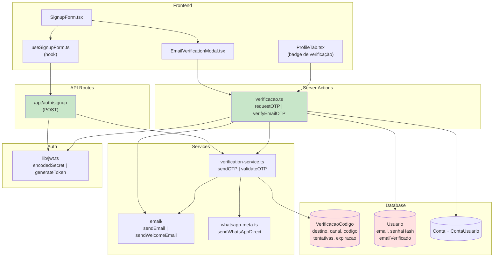
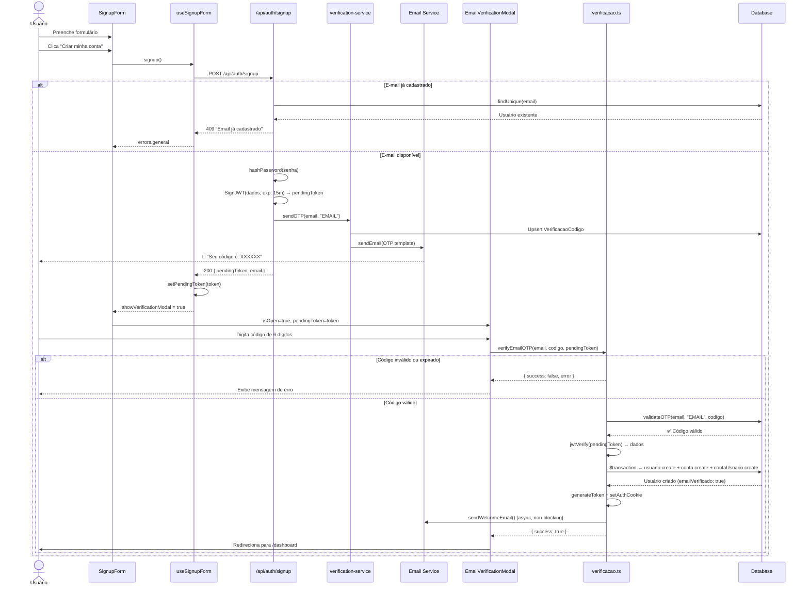
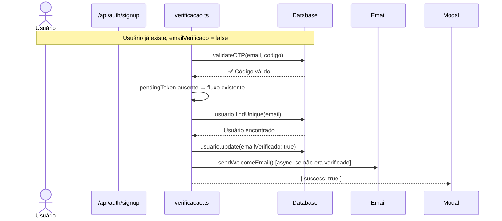
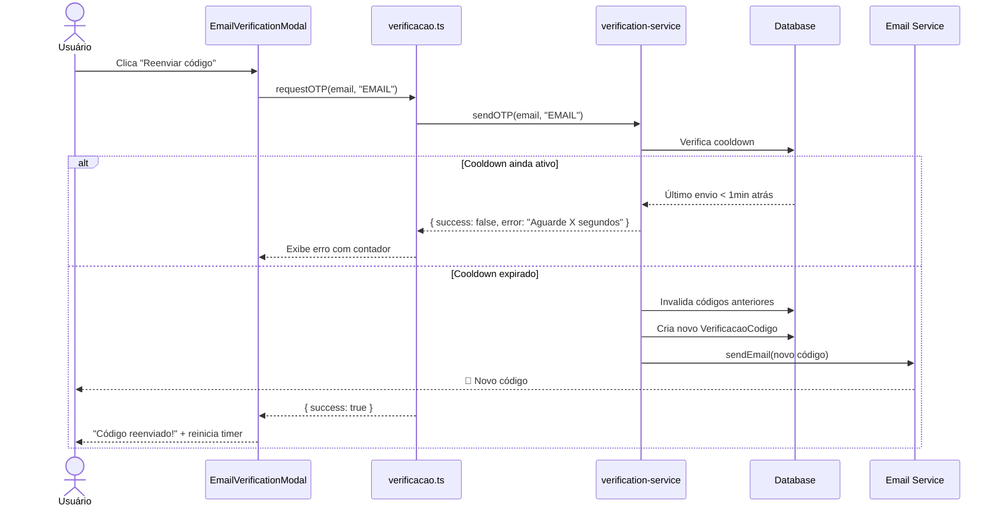
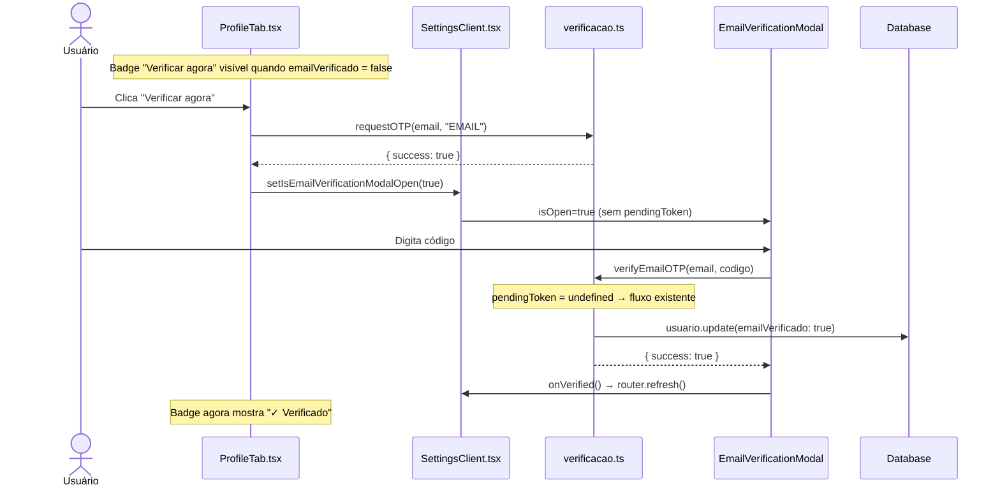
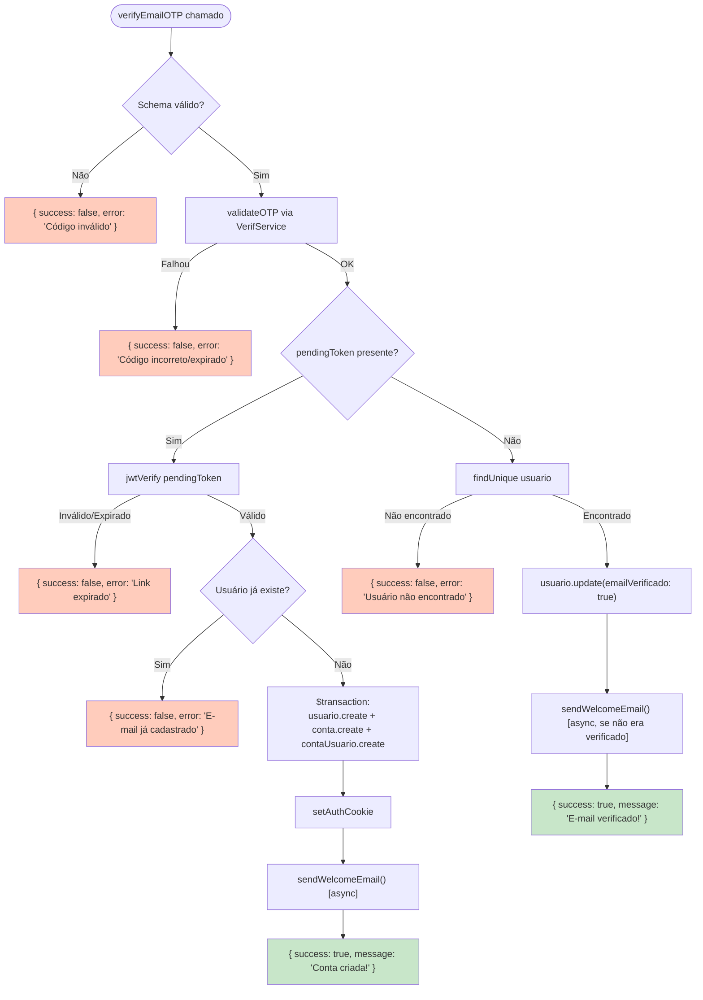

# Verificação de E-mail via OTP (One-Time Password)

> Documentação do sistema de verificação omnichannel por código de 6 dígitos, incluindo o fluxo de cadastro seguro (email-first), verificação de usuários existentes e o mecanismo de envio via e-mail ou WhatsApp.

---

## 📑 Índice

- [Visão Geral](#visão-geral)
- [Arquitetura](#arquitetura)
- [Modelos de Dados](#modelos-de-dados)
- [Fluxos Principais](#fluxos-principais)
  - [Cadastro com Verificação (Email-First)](#1-cadastro-com-verificação-email-first)
  - [Verificação de Usuário Existente](#2-verificação-de-usuário-existente)
  - [Reenvio de Código](#3-reenvio-de-código)
  - [Verificação pelo Painel de Configurações](#4-verificação-pelo-painel-de-configurações)
- [API Reference](#api-reference)
- [Segurança](#segurança)
- [Casos de Uso](#casos-de-uso)
- [Troubleshooting](#troubleshooting)

---

## Visão Geral

O sistema OTP do StreamShare garante que apenas usuários com acesso real ao e-mail cadastrado consigam criar ou acessar uma conta. Ele opera em dois modos:

1. **Fluxo de Cadastro (Email-First)**: O usuário só é criado no banco de dados **após** a validação do código OTP. Enquanto aguarda, os dados ficam em um *Pending Token* (JWT temporário de 15 minutos).
2. **Fluxo de Verificação (Existente)**: Usuários já cadastrados podem validar seu e-mail a qualquer momento pelo painel de configurações.

### Características Principais

- ✅ **Email-First Signup**: Usuário não é persistido até o código ser validado
- ✅ **Pending Token**: Dados de cadastro protegidos com JWT HS256 (15min TTL)
- ✅ **Zero Race Conditions**: OTP é disparado server-side durante o signup
- ✅ **Omnichannel**: Suporte a envio via E-mail e WhatsApp
- ✅ **Anti-Replay**: Tentativas limitadas e cooldown entre reenvios
- ✅ **Verificação Manual**: Badge de status de e-mail nas configurações de perfil
- ✅ **Welcome Email Automático**: Enviado assincronamente após verificação bem-sucedida

---

## Arquitetura

### Componentes do Sistema



### Stack Tecnológica

| Componente | Tecnologia |
|---|---|
| Tokens Temporários | JWT (jose · HS256 · 15min) |
| Códigos OTP | PIN de 6 dígitos numéricos |
| Persistência OTP | Prisma + PostgreSQL (`VerificacaoCodigo`) |
| Envio E-mail | Nodemailer (SMTP configurado no `.env`) |
| Envio WhatsApp | Meta Cloud API (`whatsapp-meta.ts`) |
| Criação de Usuário | Transação ACID (`prisma.$transaction`) |

---

## Modelos de Dados

### VerificacaoCodigo

Armazena os códigos OTP temporários, com suporte a múltiplos canais.

```prisma
model VerificacaoCodigo {
  id         Int      @id @default(autoincrement())
  destino    String   // E-mail ou telefone E.164 (+5511...)
  canal      String   @default("EMAIL") // "EMAIL" | "WHATSAPP"
  codigo     String   // PIN de 6 dígitos
  tentativas Int      @default(0)
  verificado Boolean  @default(false)
  expiracao  DateTime
  createdAt  DateTime @default(now())

  @@index([destino, codigo])
  @@map("verificacao_codigo")
}
```

> [!NOTE]
> Os registros de OTP expirados **não são deletados automaticamente**. O campo `verificado` e `expiracao` são usados para invalidar entradas antigas.

### Pending Token (Signup)

Não é uma tabela — é um **JWT temporário** gerado durante o signup e armazenado no cliente:

```typescript
// Payload do pendingToken
{
  nome: string;           // Nome do usuário
  email: string;          // E-mail verificado
  senhaHash: string;      // bcrypt hash da senha
  termsVersion: string;   // Versão dos termos aceita
  privacyVersion: string; // Versão da política aceita
  type: "PENDING_SIGNUP"; // Identificador de tipo
  iat: number;            // Issued At
  exp: number;            // Expira em 15 minutos
}
```

> [!IMPORTANT]
> O `pendingToken` é assinado com o mesmo `JWT_SECRET` usado para tokens de sessão (`src/lib/jwt.ts`). Nunca compartilhe ou logue esse valor.

---

## Fluxos Principais

### 1. Cadastro com Verificação (Email-First)

Este é o fluxo principal ao criar uma conta nova. O usuário **não é salvo no banco** até validar o e-mail.



**Arquivos envolvidos:**
- [`src/app/api/auth/signup/route.ts`](../../src/app/api/auth/signup/route.ts) — Valida, gera hash da senha, emite pendingToken e dispara OTP
- [`src/actions/verificacao.ts`](../../src/actions/verificacao.ts) — `verifyEmailOTP` cria o usuário após validação
- [`src/hooks/useSignupForm.ts`](../../src/hooks/useSignupForm.ts) — Gerencia estado do form e do pendingToken
- [`src/components/auth/EmailVerificationModal.tsx`](../../src/components/auth/EmailVerificationModal.tsx) — Interface de digitação do código
- [`src/components/auth/SignupForm.tsx`](../../src/components/auth/SignupForm.tsx) — Passa o pendingToken para o modal

---

### 2. Verificação de Usuário Existente

Fluxo para usuários já criados no banco que ainda não verificaram o e-mail (ex: cadastros migrados).



> [!NOTE]
> Se `pendingToken` **não** for enviado, a action `verifyEmailOTP` opera em modo *fallback*, apenas atualizando o campo `emailVerificado` do usuário já existente.

---

### 3. Reenvio de Código

O usuário pode solicitar um novo código diretamente no modal de verificação.



---

### 4. Verificação pelo Painel de Configurações

O usuário logado pode verificar o e-mail em **Configurações → Meu Perfil**.



**Comportamento visual do badge:**

| Estado | Badge |
|---|---|
| `emailVerificado = false` | 🟠 *Verificar agora* (botão laranja, dispara OTP ao clicar) |
| `emailVerificado = true` | 🟢 *Verificado* (ícone verde, apenas informativo) |

---

## API Reference

### POST /api/auth/signup

Valida os dados do novo usuário, gera um `pendingToken` e dispara o primeiro OTP.

> [!IMPORTANT]
> Esta rota **não cria o usuário** no banco. A criação acontece somente em `verifyEmailOTP` após validação do código.

**Request:**
```json
{
  "nome": "João Silva",
  "email": "joao@example.com",
  "senha": "MinhaS3nha!",
  "termsAccepted": true,
  "termsVersion": "1.0.0",
  "privacyAccepted": true,
  "privacyVersion": "1.0.0"
}
```

**Response 200:**
```json
{
  "message": "Código de verificação enviado",
  "pendingToken": "eyJhbGciOiJIUzI1NiJ9...",
  "email": "joao@example.com"
}
```

**Erros:**
| Status | Erro |
|---|---|
| `400` | Nome, email ou senha ausentes |
| `400` | Senha com menos de 6 caracteres |
| `400` | Termos ou política não aceitos |
| `409` | E-mail já cadastrado |
| `500` | Erro interno |

---

### Server Action: requestOTP

Solicita o envio de um código OTP para um destino.

```typescript
// src/actions/verificacao.ts
export async function requestOTP(
  destino: string,  // E-mail ou telefone E.164
  canal: "EMAIL" | "WHATSAPP"
): Promise<{ success: boolean; error?: string; cooldownSeconds?: number }>
```

**Comportamento:**
- Gera um PIN de 6 dígitos aleatório
- Invalida códigos anteriores para o mesmo destino/canal
- Respeita cooldown de 60 segundos entre reenvios
- Limita a 5 tentativas por código antes de invalidar

---

### Server Action: verifyEmailOTP

Valida o código e finaliza a operação (cria usuário ou marca como verificado).

```typescript
// src/actions/verificacao.ts
export async function verifyEmailOTP(
  destino: string,     // E-mail
  codigo: string,      // 6 dígitos
  pendingToken?: string // JWT do signup — se ausente, opera em modo existente
): Promise<{ success: boolean; message?: string; error?: string }>
```

**Fluxo de decisão:**



---

## Segurança

### Ameaças Mitigadas

| Ameaça | Mitigação |
|---|---|
| **Cadastro sem verificação** | Usuário não é criado até o OTP ser validado |
| **Race condition dupla criação** | `findUnique` antes do `$transaction` no momento da criação |
| **Token pendente vitalício** | JWT expira em 15 minutos automaticamente |
| **Replay de código OTP** | Campo `verificado = true` após uso; tentativas limitadas a 5 |
| **Brute force de código** | Cooldown de 60s entre reenvios; expiração de 10 minutos |
| **Enumeração de e-mails** | A rota retorna 409 apenas para duplicatas — considere mascarar em v2 |
| **Persistência de dados sensíveis** | senhaHash é carregada no pendingToken (JWT), nunca em plaintext |

> [!WARNING]
> O `senhaHash` trafega no payload do `pendingToken`. Embora seja um hash bcrypt (não reversível) e o JWT seja assinado, evite logar ou expor esse token em ferramentas de diagnóstico.

### Validade dos Tokens

| Token | TTL | Armazenamento |
|---|---|---|
| `pendingToken` (signup) | 15 minutos | Cliente (memória React) |
| `auth-token` (sessão) | 7 dias | Cookie HttpOnly |
| OTP Code | 10 minutos | Banco de dados |

---

## Casos de Uso

### Caso 1: Cadastro Bem-Sucedido

**Situação:** Novo usuário, e-mail disponível, SMTP configurado.

1. Preenche formulário de signup
2. API valida dados → gera `pendingToken` → dispara OTP
3. Modal abre → usuário digita código recebido
4. `verifyEmailOTP` valida código + pendingToken → cria usuário + conta
5. Cookie de sessão é definido → redireciona para `/dashboard`
6. E-mail de boas-vindas chega de forma assíncrona

**Resultado:** Usuário autenticado, `emailVerificado = true`

---

### Caso 2: Código Expirado

**Situação:** Usuário demora mais de 10 minutos para digitar o código.

1. Digita o código
2. `verifyEmailOTP` retorna `{ success: false, error: "Código expirado" }`
3. Modal exibe erro e botão "Reenviar código"
4. Usuário clica em reenviar → novo código enviado → fluxo continua normalmente

> [!NOTE]
> O `pendingToken` tem 15 minutos. Se também expirar, o usuário deve reiniciar o cadastro (o formulário ainda terá os dados preenchidos no estado React).

---

### Caso 3: E-mail Não Verificado (Usuário Antigo)

**Situação:** Usuário criado antes da implementação do OTP, `emailVerificado = false`.

1. Acessa `/configuracoes → Meu Perfil`
2. Vê badge laranja "Verificar agora" ao lado do campo de e-mail
3. Clica → OTP é enviado
4. Modal de verificação abre (sem `pendingToken`)
5. Digita código → `verifyEmailOTP` atualiza `emailVerificado = true`
6. Badge muda para verde "✓ Verificado"

---

### Caso 4: SMTP Não Configurado

**Situação:** Variáveis SMTP ausentes no `.env`, usuário tenta cadastrar.

1. API chama `sendOTP` → VerifService chama `sendEmail`
2. `createTransporter` lança `Error("SMTP_HOST não configurado")`
3. O `try/catch` no signup captura o erro e o loga no servidor
4. API **ainda retorna 200** com o `pendingToken` (o modal abre)
5. Modal tenta validar com o código — mas o e-mail não chegou
6. Usuário pode tentar "Reenviar" → mesmo erro silencioso

> [!CAUTION]
> Sem SMTP configurado, o cadastro ficará bloqueado na etapa de verificação. Configure `SMTP_HOST`, `SMTP_PORT`, `SMTP_USER` e `SMTP_PASS` no `.env`. Consulte [EMAIL_SETUP.md](../setup/EMAIL_SETUP.md).

---

## Troubleshooting

### ❌ "Código inválido" mesmo digitando o código do e-mail

**Causa provável:** Dois pedidos de OTP foram disparados (cliente e servidor), o segundo invalidou o primeiro.

**Diagnóstico:** Verifique no banco se existem dois registros `VerificacaoCodigo` com o mesmo `destino` — o mais recente é o válido.

**Solução:** Com a implementação atual, o OTP é disparado **apenas** no servidor (`signup/route.ts`). A chamada redundante do cliente foi removida. Se o problema persistir, verifique se não há outra chamada a `requestOTP` sendo feita antes de o modal abrir.

---

### ❌ "Link de registro expirado ou inválido"

**Causa:** O `pendingToken` expirou (> 15 minutos desde o clique em "Criar conta") ou o `JWT_SECRET` foi alterado entre o signup e a verificação.

**Solução:** O usuário deve fechar o modal e refazer o cadastro. Os dados do formulário permanecem no estado React (a menos que a página tenha sido recarregada).

---

### ❌ Modal fecha mas usuário não está logado

**Causa:** Falha silenciosa em `setAuthCookie` ou redirecionamento não executado.

**Diagnóstico:** Verifique o console do servidor para erros após o `verifyEmailOTP`. Confirme que `generateToken` e `setAuthCookie` retornaram sem exceção.

---

### ❌ E-mail de verificação não chega

1. Verifique se o SMTP está configurado: `SMTP_HOST`, `SMTP_PORT`, `SMTP_USER`, `SMTP_PASS`
2. Acesse `/admin/diagnostico` → aba **Email** → clique em **Testar SMTP**
3. Verifique a pasta de spam do destinatário
4. Confirme que `EMAIL_FROM` usa o mesmo domínio do `SMTP_USER`

Consulte [EMAIL_SETUP.md](../setup/EMAIL_SETUP.md) para configurações avançadas.

---

**Última atualização**: 2026-02-26
**Versão**: 1.0.0
**Status**: ✅ Implementado e em produção
