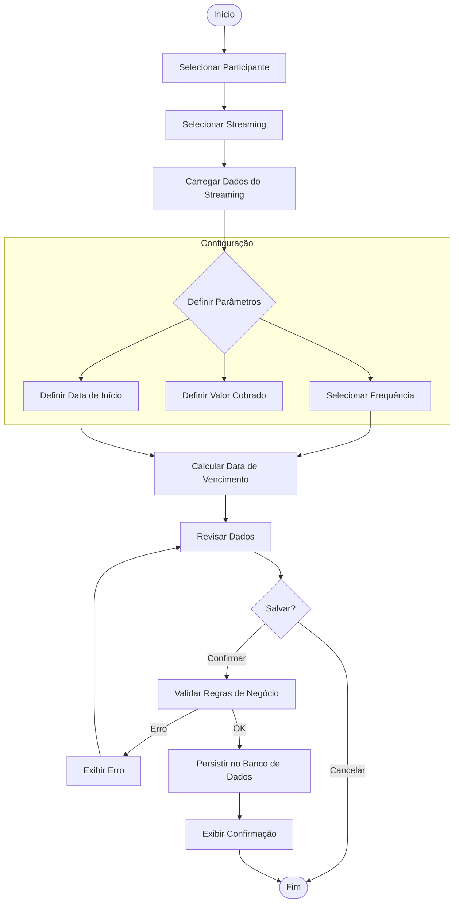

# Feature de Assinatura: Fluxo de Criação

Este documento detalha o processo de criação de uma nova assinatura por um administrador no sistema StreamShare.

## Visão Geral

A criação de uma assinatura é o processo que vincula um **Participante** a um **Streaming**, estabelecendo as regras financeiras (valor, frequência) e temporais (início, vencimento) dessa relação.

## Fluxograma

## Detalhamento do Processo

### 1. Seleção das Entidades
- **Participante**: O administrador deve selecionar quem é o titular da assinatura.
  - *Origem*: Pode vir pré-selecionado se o fluxo iniciar na página do participante.
- **Streaming**: O serviço que será assinado.
  - *Regra*: Deve ser um streaming ativo e com vagas disponíveis (opcional: o sistema pode permitir *overbooking* se configurado, mas o padrão é respeitar o `limiteParticipantes` do `Streaming`).

### 2. Configuração da Assinatura
O sistema deve preencher valores padrão para agilizar o cadastro, mas permitir customização:

- **Frequência de Pagamento**:
  - *Padrão*: Mensal (ou a primeira disponível nas configurações do streaming).
  - *Opções*: Mensal, Trimestral, Semestral, Anual.
- **Valor Cobrado**:
  - *Padrão*: Valor sugerido do streaming (normalmente `valorIntegral / limiteParticipantes` ou um valor fixo definido).
  - *Edição*: O admin pode alterar para cobrar um valor diferenciado (desconto ou acréscimo).
- **Data de Início**:
  - *Padrão*: Data atual (`Today`).
- **Data de Vencimento**:
  - *Cálculo Automático*: `Data de Início + Frequência` (ex: 1 mês depois).
  - *Ajuste Manual*: O admin pode ajustar o dia de vencimento para alinhar com o ciclo de pagamento do participante (ex: todo dia 5).

### 3. Validações (Backend)
Antes de salvar, o sistema deve garantir:
1.  **Unicidade**: O participante não possui outra assinatura ativa ou suspensa para o mesmo streaming.
2.  **Capacidade**: O streaming possui vagas (se a regra de limite for estrita).
3.  **Dados**: Valor não pode ser negativo; datas devem ser coerentes (Vencimento > Início).

### 4. Persistência
Ao confirmar, criar o registro na tabela `Assinatura` com:
- `status`: `ativa` (padrão inicial).
- `diasAtraso`: 0.

## Interface Sugerida (Mockup Mental)

- **Modal ou Página Dedicada**: "Nova Assinatura".
- **Step 1**: Select de Participantes (Searchable).
- **Step 2**: Select de Streamings (Cards com ícones).
- **Step 3**: Form de Configuração (Grid).
  - Row 1: Frequência (Dropdown) | Valor (Input Currency).
  - Row 2: Início (Date Picker) | Vencimento (Date Picker - Auto updated).
- **Footer**: Botões "Cancelar" e "Criar Assinatura".
