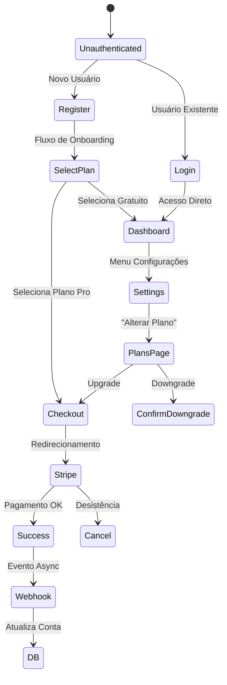

# Fluxo de Assinaturas e Pagamentos - StreamShare

Este documento detalha todos os fluxos de assinatura, ciclo de vida e decisões de design do sistema de pagamentos do StreamShare.

---

## 🧭 Visão Geral

O sistema de assinaturas do StreamShare gerencia dois tipos distintos de cobrança:
1.  **Assinatura da Conta (SaaS)**: O pagamento que o administrador da conta faz para usar a plataforma (Plano Pro vs Básico).
2.  **Assinatura de Streaming (Interno)**: O controle que o administrador faz sobre os participantes que consomem os serviços (ex: Netflix, Spotify).

> **Este guia foca no item 1: Assinatura da Conta (SaaS) via Stripe.**

---

## 📊 Fluxograma Geral (SaaS)

---

## 📝 Casos de Uso Detalhados

### 1. Novo Usuário (Acquisition Flow)

Este fluxo ocorre quando um visitante decide criar uma conta já escolhendo um plano.

1.  **Entrada**: Landing Page -> Botão "Assinar Pro".
2.  **Parâmetro**: Redireciona para `/login?plan=price_PRO_ID`.
3.  **Registro**: Usuário cria conta.
4.  **Ponte Intermediária**:
    -   A página `/checkout/start` detecta o parâmetro `plan`.
    -   Chama a server action `createCheckoutSession`.
    -   Redireciona automaticamente para o Stripe.
5.  **Pós-Checkout**:
    -   Retorna para `/checkout/success`.
    -   Redireciona para `/dashboard` com toast de sucesso.

### 2. Upgrade de Plano (Upsell)

Usuário logado no plano Básico decide migrar para o Pro.

1.  **Navegação**: Configurações -> Plano Atual -> Alterar Plano.
2.  **Seleção**: Escolhe "Profissional".
3.  **Confirmação**: Modal explica a cobrança de R$ 29,90.
4.  **Checkout**: Pagamento no Stripe.
5.  **Webhook**: O Stripe envia `checkout.session.completed` contendo o `client_reference_id` (ID da Conta).
6.  **Banco**: O sistema atualiza `Conta.plano = 'pro'` e salva o `stripeSubscriptionId`.

### 3. Downgrade de Plano (Churn Prevention)

Usuário no plano Pro decide voltar para o Básico.

1.  **Seleção**: Escolhe "Plano Básico" na página de planos.
2.  **Confirmação**: Modal alerta sobre perda de benefícios.
3.  **Ação**: O sistema chama o Portal do Cliente Stripe (`billingPortal`).
4.  **No Stripe**: O usuário cancela a assinatura.
5.  **Webhook**: O Stripe envia `customer.subscription.deleted` ou `updated`.
6.  **Banco**: O sistema reverte para `Conta.plano = 'basico'`.

### 4. Falha no Pagamento (Dunning)

O cartão do usuário expira ou não tem limite na renovação.

1.  **Stripe**: Tenta cobrar e falha.
2.  **Webhook**: Envia `customer.subscription.updated` com status `past_due`.
3.  **Sistema**:
    -   Não bloqueia acesso imediatamente (Grace Period).
    -   Exibe banner de alerta no Dashboard.
4.  **Recuperação**: Usuário clica no banner -> Portal Stripe -> Atualiza Cartão.
5.  **Sucesso**: Webhook envia status `active` -> Remove banner.

---

## 🛠️ Decisões Técnicas

### 1. Fonte da Verdade (Source of Truth)

Decidimos que o **Stripe é a fonte da verdade** para o estado financeiro.
-   **NÃO** usamos CRON jobs para verificar vencimentos.
-   Confiamos 100% nos **Webhooks** para atualizar o banco local.
-   O banco local serve apenas como "cache" de leitura rápida para a UI (para não bater na API do Stripe em todo request).

### 2. Identificação de Contas

Como ligar o pagamento do Stripe à conta correta no Postgres?
-   Usamos o campo `client_reference_id` na criação da Sessão de Checkout.
-   Passamos o `conta.id` (interno) nesse campo.
-   O Webhook lê esse ID e sabe exatamente qual conta atualizar.

### 3. Portal do Cliente

Ao invés de recriar telas de "Gerenciar Cartão" ou "Ver Faturas", usamos o **Stripe Customer Portal**.
-   Menos código para manter.
-   Mais segurança (dados de cartão nunca passam pelo nosso servidor).
-   UX familiar para o usuário.

---

## 🚨 Tratamento de Falhas (Warning Banner)

Implementamos um sistema de alerta global para notificar o usuário sobre problemas no pagamento.

1.  **Server-Side**: O Layout do Dashboard (`dashboard/layout.tsx`) verifica o status da assinatura (`stripeSubscriptionStatus`).
2.  **Banner**: Se o status for `past_due` (amarelo) ou `unpaid/canceled` (vermelho), o componente `SubscriptionAlert` é renderizado.
3.  **Ação**: O usuário clica em "Atualizar Cartão" -> Action `createCustomerPortalSession` -> Redireciona para Stripe Portal.

---

## 📚 Referências de Código

-   **Checkout**: [`src/actions/planos.ts`](../../src/actions/planos.ts) (Inclui `createCustomerPortalSession`)
-   **Webhooks**: [`src/app/api/webhooks/stripe/route.ts`](../../src/app/api/webhooks/stripe/route.ts)
-   **Config**: [`src/config/plans.ts`](../../src/config/plans.ts)
-   **UI**: [`src/components/dashboard/SubscriptionAlert.tsx`](../../src/components/dashboard/SubscriptionAlert.tsx)
