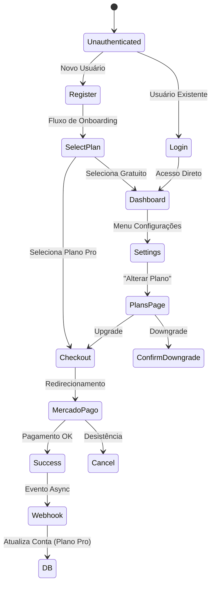

# Fluxo de Assinaturas e Pagamentos - StreamShare

Este documento detalha todos os fluxos de assinatura, ciclo de vida e decisões de design do sistema de pagamentos do StreamShare.

---

## 🧭 Visão Geral

O sistema de assinaturas do StreamShare gerencia dois tipos distintos de cobrança:
1.  **Assinatura da Conta (SaaS)**: O pagamento que o administrador da conta faz para usar a plataforma (Plano Pro vs Básico).
2.  **Assinatura de Streaming (Interno)**: O controle que o administrador faz sobre os participantes que consomem os serviços (ex: Netflix, Spotify).

> **Este guia foca no item 1: Assinatura da Conta (SaaS) E no item 2: Assinatura de Streaming, ambos via MercadoPago.**

---

## 📊 Fluxograma Geral (SaaS)

---

## 📝 Casos de Uso Detalhados

### 1. Novo Usuário (Acquisition Flow)

Este fluxo ocorre quando um visitante decide criar uma conta já escolhendo um plano.

1.  **Entrada**: Landing Page -> Botão "Assinar Pro".
2.  **Parâmetro**: Redireciona para `/login?plan=pro`.
3.  **Registro**: Usuário cria conta.
4.  **Ponte Intermediária**:
    -   A página `/checkout/start` detecta o parâmetro `plan`.
    -   Chama a server action `createCheckoutSession`.
    -   Redireciona automaticamente para o MercadoPago.
5.  **Pós-Checkout**:
    -   Retorna para `/checkout/success`.
    -   Redireciona para `/dashboard` com toast de sucesso.

### 2. Upgrade de Plano (Upsell)

Usuário logado no plano Básico decide migrar para o Pro.

1.  **Navegação**: Configurações -> Plano Atual -> Alterar Plano.
2.  **Seleção**: Escolhe "Profissional".
3.  **Confirmação**: Modal explica a cobrança de R$ 29,90.
4.  **Checkout**: Pagamento no MercadoPago (Assinatura Recorrente).
5.  **Webhook**: O MercadoPago envia `subscription_preapproval` contendo o `external_reference`.
6.  **Banco**: O sistema atualiza `Conta.plano = 'pro'` e salva o `gatewaySubscriptionId`.

### 3. Downgrade de Plano (Churn Prevention)

Usuário no plano Pro decide voltar para o Básico.

1.  **Seleção**: Escolhe "Plano Básico" na página de planos.
2.  **Confirmação**: Modal alerta sobre perda de benefícios.
3.  **Ação**: O sistema chama a action de cancelamento no MercadoPago.
4.  **No MP**: O usuário cancela a assinatura no painel do gateway.
5.  **Webhook**: O MercadoPago envia evento de atualização de assinatura.
6.  **Banco**: O sistema reverte para `Conta.plano = 'free'`.

### 4. Falha no Pagamento (Dunning)

O cartão do usuário expira ou não tem limite na renovação.

1.  **MercadoPago**: Tenta cobrar e falha.
2.  **Webhook**: Envia status de falha ou pendência.
3.  **Sistema**:
    -   Exibe alerta no Dashboard.
4.  **Recuperação**: Usuário acessa o painel do MercadoPago -> Atualiza Cartão.
5.  **Sucesso**: Webhook envia status `authorized` -> Normaliza conta.

---

## 🛠️ Decisões Técnicas

### 1. Fonte da Verdade (Source of Truth)

Decidimos que o **MercadoPago é a fonte da verdade** para o estado financeiro do SaaS.
-   **Conformidade**: Confiamos nos **Webhooks** para atualizar o banco local.
-   O banco local serve apenas como "cache" de leitura rápida para a UI.

### 2. Identificação de Contas

Como ligar o pagamento do Stripe à conta correta no Postgres?
-   Usamos o campo `client_reference_id` na criação da Sessão de Checkout.
-   Passamos o `conta.id` (interno) nesse campo.
-   O Webhook lê esse ID e sabe exatamente qual conta atualizar.

#### 3. Gestão de Faturas

Ao invés de recriar telas complexas, utilizamos o redirecionamento para o dashboard de assinaturas do MercadoPago.
-   Segurança Máxima.
-   Gestão centralizada de cartões no lado do gateway.

---

## 🚨 Tratamento de Falhas (Warning Banner)

Implementamos um sistema de alerta global para notificar o usuário sobre problemas no pagamento.

1.  **Server-Side**: O Layout do Dashboard (`dashboard/layout.tsx`) verifica o status da assinatura (`gatewaySubscriptionStatus`).
2.  **Banner**: Se o status for `authorized` (ativo) ou `pending` (aguardando), o acesso é normal. Se estiver suspenso, um alerta é exibido.
3.  **Ação**: O usuário clica em "Gerenciar Plano" -> Redireciona para MercadoPago.

---

## 🏦 Assinaturas de Streaming (MercadoPago / PIX)

Diferente do SaaS, as assinaturas de participantes são gerenciadas de forma mais flexível, suportando pagamentos manuais e automáticos via MercadoPago.

### 1. Inscrição Pública (Real-time Checkout)
1. **Escolha**: O participante acessa o link público, preenche os dados e escolhe **PIX** ou **Cartão**.
2. **Geração**: A action `publicSubscribe` cria a assinatura no banco e solicita ao MercadoPago o QR Code ou Preference Link.
3. **Modal**: O participante vê o QR Code instantaneamente via `PendingInvoiceModal`.
4. **Confirmação**: Via Webhook, o sistema ativa a assinatura e vincula o `gatewayId`.

### 2. Adaptive Renewal Engine (Renovação Pró-ativa)
Para evitar suspensões, o sistema antecipa a geração de cobranças:
- **Janela de 5 dias**: 5 dias antes do vencimento, o sistema gera uma nova cobrança PIX.
- **Notificação**: O participante recebe o código PIX via WhatsApp/E-mail.
- **Grace Period**: Se não pago em até 3 dias após o vencimento, a assinatura é suspensa automaticamente.

### 3. Estornos Diretos
Em caso de falha no streaming, o administrador pode cancelar a assinatura com **estorno direto**:
- O sistema chama a API de Reembolsos do MercadoPago.
- O valor retorna para o cartão ou conta original do participante.
- Status da cobrança muda para `estornado`.

---

## 📚 Referências de Código

-   **Checkout**: `src/actions/planos.ts` (Inclui `createSaaSSubscription`)
-   **Webhooks**: `src/app/api/webhooks/mercado-pago/route.ts`
-   **Config**: `src/config/plans.ts`
