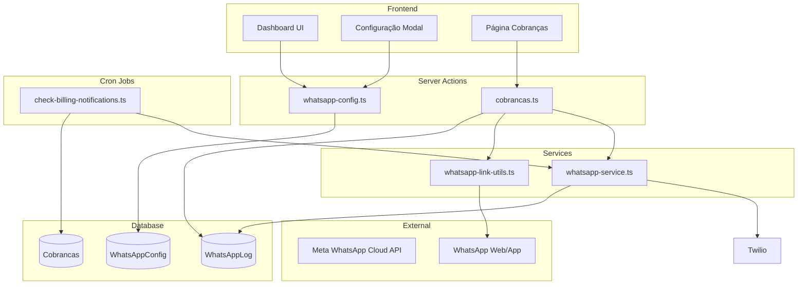
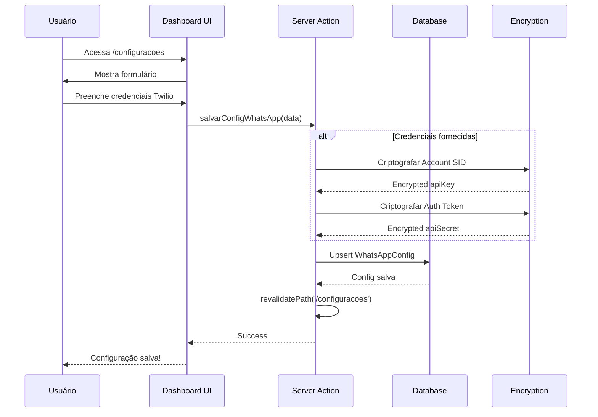
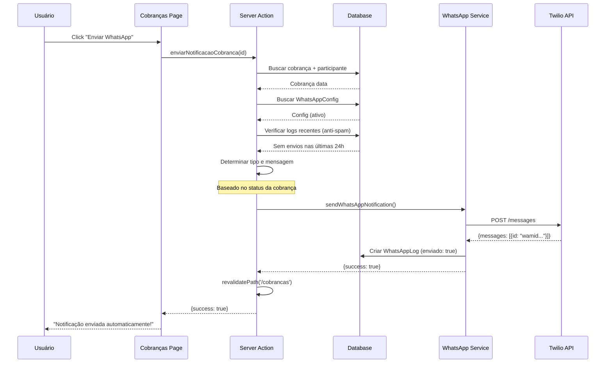
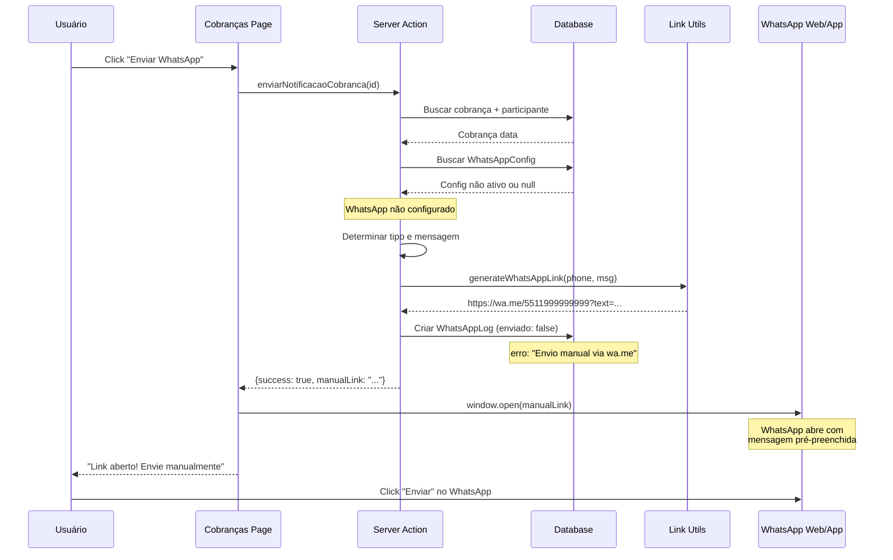
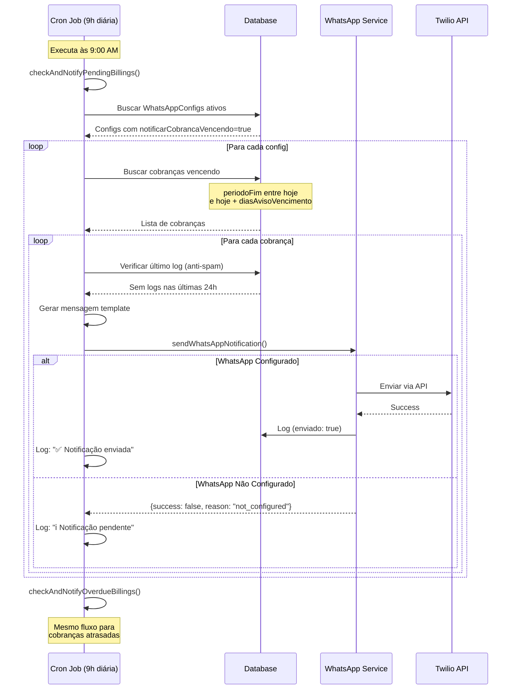
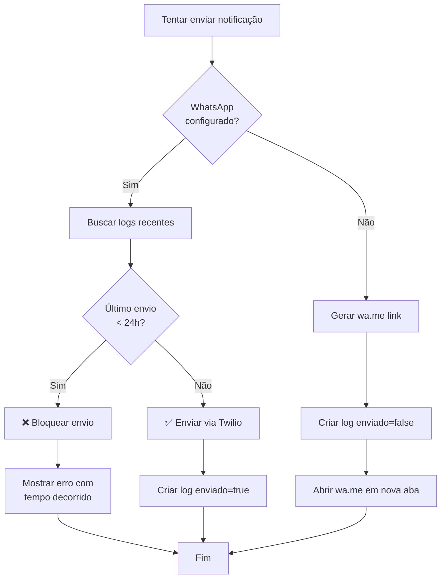
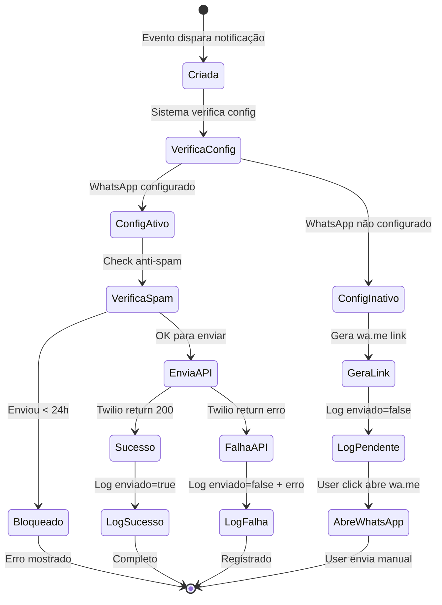
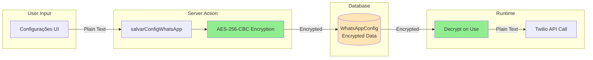

# WhatsApp Integration - Documentação Completa

## 📑 Índice

1. [Visão Geral](#visão-geral)
2. [Arquitetura](#arquitetura)
3. [Modelos de Dados](#modelos-de-dados)
4. [Fluxos Principais](#fluxos-principais)
5. [Template de Mensagens](#templates-de-mensagens)
6. [Configuração Twilio](#configuração-twilio)
7. [API Reference](#api-reference)
8. [Casos de Uso](#casos-de-uso)
9. [Troubleshooting](#troubleshooting)

---

## Visão Geral

O sistema de integração WhatsApp permite o envio de notificações automáticas e manuais para participantes através de dois mecanismos:

1. **Envio Automático (Meta Cloud API)** - Quando configurado, envia mensagens automaticamente via Meta (WhatsApp Business API Oficial)
2. **Envio Manual (wa.me)** - Quando não configurado, gera links wa.me para envio manual

### Características Principais

- ✅ **Dual Mode**: Automático via Meta Cloud API ou manual via wa.me
- ✅ **Anti-Spam**: Limita envios a 1 notificação por participante a cada 24h
- ✅ **Cron Jobs**: Notificações automáticas diárias para cobranças vencendo/atrasadas
- ✅ **Rastreamento Completo**: Todos os envios registrados em `WhatsAppLog`
- ✅ **Configuração por Conta**: Cada conta pode ter configurações independentes
- ✅ **Templates Customizáveis**: Mensagens pré-definidas para cada tipo de notificação

---

## Arquitetura

### Componentes do Sistema



### Stack Tecnológica

| Componente | Tecnologia |
|------------|------------|
| Backend | Next.js Server Actions |
| Database | Prisma + PostgreSQL |
| WhatsApp API | Meta WhatsApp Cloud API (Graph API) |
| Fallback | wa.me links |
| Cron Jobs | node-cron |
| Encryption | crypto (AES-256-CBC) |

---

## Modelos de Dados

### WhatsAppConfig

Armazena configurações da integração WhatsApp por conta.

```prisma
model WhatsAppConfig {
  id                          Int       @id @default(autoincrement())
  contaId                     Int       @unique
  provider                    String    @default("twilio")
  apiKey                      String    // Encrypted Account SID
  apiSecret                   String?   // Encrypted Auth Token
  phoneNumber                 String    // From number (plain text)
  isAtivo                     Boolean   @default(false)
  
  // Configurações de notificações
  notificarNovaAssinatura     Boolean   @default(true)
  notificarCobrancaGerada     Boolean   @default(true)
  notificarCobrancaVencendo   Boolean   @default(true)
  notificarCobrancaAtrasada   Boolean   @default(true)
  notificarAssinaturaSuspensa Boolean   @default(true)
  notificarPagamentoConfirmado Boolean  @default(true)
  
  // Configurações de timing
  diasAvisoVencimento         Int       @default(3)
  
  createdAt                   DateTime  @default(now())
  updatedAt                   DateTime  @updatedAt
  
  conta                       Conta     @relation(fields: [contaId], references: [id])
  logs                        WhatsAppLog[]
}
```

> [!IMPORTANT]
> As credenciais (`apiKey` e `apiSecret`) são **criptografadas** usando AES-256-CBC antes de serem armazenadas no banco de dados.

### WhatsAppLog

Registra todas as tentativas de envio de mensagens.

```prisma
model WhatsAppLog {
  id              Int                      @id @default(autoincrement())
  configId        Int?
  participanteId  Int
  tipo            TipoNotificacaoWhatsApp
  numeroDestino   String
  mensagem        String                   @db.Text
  enviado         Boolean                  @default(false)
  erro            String?
  providerId      String?                  // Twilio Message SID
  createdAt       DateTime                 @default(now())
  
  config          WhatsAppConfig?          @relation(fields: [configId], references: [id])
  participante    Participante             @relation(fields: [participanteId], references: [id])
}
```

**Campos Principais:**
- `enviado`: `true` = enviado via API, `false` = manual ou falha
- `erro`: Mensagem de erro se falhou ou "Envio manual via wa.me"
- `providerId`: SID da mensagem no Twilio (quando enviado com sucesso)

### TipoNotificacaoWhatsApp

```typescript
enum TipoNotificacaoWhatsApp {
  nova_assinatura
  cobranca_gerada
  cobranca_vencendo
  cobranca_atrasada
  assinatura_suspensa
  pagamento_confirmado
}
```

---

## Fluxos Principais

### 1. Configuração do WhatsApp



**Endpoints:**
- `POST /api/whatsapp/config` via `salvarConfigWhatsApp()`
- `GET /api/whatsapp/config` via `getConfigWhatsApp()`

---

### 2. Envio Automático (Twilio)



**Métricas de Sucesso:**
- `WhatsAppLog.enviado = true`
- `WhatsAppLog.providerId` contém o ID gerado pela Meta (wamid...)
- `WhatsAppLog.erro = null`

---

### 3. Envio Manual (wa.me Fallback)



**Formato do Link wa.me:**
```
https://wa.me/[phone]?text=[encoded_message]
```

**Exemplo:**
```
https://wa.me/5511999999999?text=Lembrete%3A%20Sua%20cobran%C3%A7a...
```

---

### 4. Cron Job - Notificações Automáticas



**Configuração do Cron:**
```typescript
// Executa diariamente às 9:00 AM
cron.schedule('0 9 * * *', async () => {
    await checkAndNotifyPendingBillings();
    await checkAndNotifyOverdueBillings();
});
```

---

### 5. Anti-Spam Protection



**Query de Verificação:**
```typescript
const ultimoLog = await prisma.whatsAppLog.findFirst({
    where: {
        configId: whatsappConfig.id,
        participanteId: participanteId,
        createdAt: { gte: subHours(new Date(), 24) },
        enviado: true
    },
    orderBy: { createdAt: 'desc' }
});

if (ultimoLog) {
    throw new Error(
        `⏰ Já foi enviada uma notificação WhatsApp ${tempoDecorrido}. ` +
        `Aguarde 24 horas para enviar novamente.`
    );
}
```

---

## Templates de Mensagens

### Estrutura dos Templates

Todos os templates estão definidos em [whatsapp-service.ts](file:///w:/projetos/streamsharev2/apps/web/src/lib/whatsapp-service.ts#L203-L221).

```typescript
export const whatsappTemplates = {
    novaAssinatura: (participante, streaming, valor, dataInicio) => string,
    cobrancaGerada: (participante, streaming, valor, vencimento) => string,
    cobrancaVencendo: (participante, streaming, valor, dias) => string,
    cobrancaAtrasada: (participante, streaming, valor, diasAtraso) => string,
    assinaturaSuspensa: (participante, streaming) => string,
    pagamentoConfirmado: (participante, streaming, valor) => string,
}
```

### Templates Disponíveis

#### 1. Nova Assinatura
```
Olá ${participante}! ✨

Sua assinatura de *${streaming}* foi confirmada!

💰 Valor: ${valor}
📅 Início: ${dataInicio}

Em breve você receberá as credenciais de acesso.
```

#### 2. Cobrança Gerada
```
Olá ${participante}! 📝

Nova cobrança gerada para *${streaming}*:

💰 Valor: ${valor}
📅 Vencimento: ${vencimento}

Aguardamos seu pagamento!
```

#### 3. Cobrança Vencendo
```
Lembrete: Sua cobrança de *${streaming}* vence em ${dias} dia(s)! ⏰

💰 Valor: ${valor}

Evite suspensão do serviço realizando o pagamento.
```

#### 4. Cobrança Atrasada
```
⚠️ ${participante}, sua cobrança de *${streaming}* está ${diasAtraso} dia(s) em atraso.

💰 Valor: ${valor}

Realize o pagamento para manter seu acesso ativo.
```

#### 5. Assinatura Suspensa
```
❌ ${participante}, sua assinatura de *${streaming}* foi suspensa por falta de pagamento.

Regularize para reativar o acesso.
```

#### 6. Pagamento Confirmado
```
✅ ${participante}, pagamento confirmado!

*${streaming}*
💰 ${valor}

Obrigado! Seu acesso continua ativo.
```

### Mapeamento Tipo → Template

```typescript
switch (cobranca.status) {
    case 'pendente':
        tipo = 'cobranca_vencendo';
        mensagem = whatsappTemplates.cobrancaVencendo(...);
        break;
    
    case 'atrasado':
        tipo = 'cobranca_atrasada';
        mensagem = whatsappTemplates.cobrancaAtrasada(...);
        break;
    
    case 'pago':
        tipo = 'pagamento_confirmado';
        mensagem = whatsappTemplates.pagamentoConfirmado(...);
        break;
}
```

---

## Configuração Meta WhatsApp Cloud API

### 1. Criar Aplicativo na Meta

1. Acesse o [Meta for Developers](https://developers.facebook.com/)
2. Crie um novo aplicativo do tipo **Business**
3. Adicione o produto **WhatsApp** ao aplicativo

### 2. Configurar Número

1. Nas configurações do produto WhatsApp, clique em "API Setup / Configuração da API"
2. Você pode usar o número de teste fornecido pela Meta (Phone Number ID / ID do número de telefone)
3. Para produção, adicione um novo número na Business Manager e faça as devidas verificações

### 3. Obter Credenciais

Copie os seguintes dados do painel do aplicativo (WhatsApp > API Setup):
- **Access Token** (Recomenda-se gerar um token permanente através de um usuário de sistema no Business Manager)
- **Phone Number ID** (ID do número de telefone)

### 4. Configurar no StreamShare / Arquivo .env

Para integrar com sucesso o StreamShare à API da Meta, modifique seu arquivo `.env`:

```bash
WHATSAPP_ENABLED="true"
WHATSAPP_ACCESS_TOKEN="[EAAXXXX...]"
WHATSAPP_PHONE_NUMBER_ID="[123456...]"
WHATSAPP_API_VERSION="v21.0"
```

> [!IMPORTANT]
> A API oficial exige templates aprovados para a sua conta para realizar envios iniciados pela empresa (outbound) em produção. O StreamShare fará envios do tipo `text` que funcionam apenas na janela de 24h ou durante testes/sandbox. Pode ser necessário revisar a integração com templates do Meta, substituindo mensagens puras de texto pelos objetos do tipo "template".

### 5. Testar Configuração

Você pode acionar o teste diretamente do painel Parameters -> Diagnostics.

```bash
# Na UI de configuração (Aba Diagnósticos) clique em "Testar Conexão WhatsApp"
```

---

## API Reference

### Server Actions

#### salvarConfigWhatsApp

Salva ou atualiza a configuração do WhatsApp.

```typescript
async function salvarConfigWhatsApp(data: {
    provider?: string;
    apiKey?: string;
    apiSecret?: string;
    phoneNumber?: string;
    isAtivo?: boolean;
    notificarNovaAssinatura?: boolean;
    notificarCobrancaGerada?: boolean;
    notificarCobrancaVencendo?: boolean;
    notificarCobrancaAtrasada?: boolean;
    notificarAssinaturaSuspensa?: boolean;
    notificarPagamentoConfirmado?: boolean;
    diasAvisoVencimento?: number;
}): Promise<WhatsAppConfig>
```

**Comportamento:**
- Criptografa `apiKey` e `apiSecret` antes de salvar
- Usa `upsert` para criar ou atualizar
- Revalida `/configuracoes` após salvar

---

#### getConfigWhatsApp

Busca a configuração do WhatsApp da conta atual.

```typescript
async function getConfigWhatsApp(): Promise<WhatsAppConfig | null>
```

**Retorno:**
- `null` se não configurado
- Objeto `WhatsAppConfig` descriptografado

---

#### enviarNotificacaoCobranca

Envia notificação WhatsApp para uma cobrança.

```typescript
async function enviarNotificacaoCobranca(
    cobrancaId: number
): Promise<{
    success: boolean;
    manualLink?: string;
    message?: string;
}>
```

**Retornos Possíveis:**

```typescript
// Sucesso automático (Twilio)
{ success: true }

// Sucesso manual (wa.me)
{
    success: true,
    manualLink: "https://wa.me/5511999999999?text=...",
    message: "Abra o link para enviar manualmente pelo WhatsApp"
}

// Erro (lança exceção)
throw new Error("⏰ Já foi enviada uma notificação...")
```

**Anti-Spam:**
- Bloqueia envios duplicados em 24h
- Verifica `WhatsAppLog` com `enviado: true`

---

### WhatsApp Service

#### sendWhatsAppNotification

Função interna para enviar via Twilio.

```typescript
async function sendWhatsAppNotification(
    contaId: number,
    tipo: TipoNotificacaoWhatsApp,
    participanteId: number,
    mensagem: string
): Promise<{
    success: boolean;
    providerId?: string;
    error?: string;
    reason?: 'not_configured' | 'notification_disabled';
}>
```

**Fluxo:**
1. Busca `WhatsAppConfig`
2. Verifica se ativo e tipo habilitado
3. Descriptografa credenciais
4. Envia via Twilio
5. Cria log em `WhatsAppLog`

---

### Link Utils

#### generateWhatsAppLink

Gera link wa.me para envio manual.

```typescript
function generateWhatsAppLink(
    phoneNumber: string,
    message: string
): string
```

**Exemplo:**
```typescript
const link = generateWhatsAppLink(
    'whatsapp:+5511999999999',
    'Olá! Sua cobrança vence amanhã.'
);
// Retorna: https://wa.me/5511999999999?text=Ol%C3%A1!%20Sua%20cobran%C3%A7a...
```

**Normalização:**
- Remove prefixo `whatsapp:`
- Remove caracteres especiais
- Adiciona `+55` se necessário (Brasil)
- URL-encode da mensagem

---

## Casos de Uso

### Caso 1: Primeira Configuração

**Situação:** Conta nova sem WhatsApp configurado

**Usuário:**
1. Acessa `/configuracoes`
2. Clica em "Integrações → WhatsApp"
3. Vê formulário vazio com link para Twilio
4. Segue instruções para obter credenciais
5. Preenche e salva

**Sistema:**
1. Criptografa credenciais
2. Salva `WhatsAppConfig` com `isAtivo: true`
3. Mostra mensagem de sucesso

**Resultado:** WhatsApp configurado e ativo

---

### Caso 2: Envio de Cobrança Vencendo (Automático)

**Situação:** WhatsApp configurado, cobrança vencendo em 2 dias

**Usuário:**
1. Acessa `/cobrancas`
2. Localiza cobrança pendente
3. Clica em "⋮" → "Enviar WhatsApp"

**Sistema:**
1. Verifica configuração ativa ✅
2. Verifica anti-spam (sem envios em 24h) ✅
3. Gera mensagem: `cobrancaVencendo(...)`
4. Envia via Twilio
5. Cria log: `enviado: true`
6. Mostra "Notificação enviada automaticamente!"

**Resultado:** Participante recebe WhatsApp automaticamente

---

### Caso 3: Envio Manual (Fallback)

**Situação:** WhatsApp NÃO configurado, cobrança atrasada

**Usuário:**
1. Acessa `/cobrancas`
2. Clica em "Enviar WhatsApp"

**Sistema:**
1. Verifica configuração: `null` ou `isAtivo: false`
2. Gera mensagem: `cobrancaAtrasada(...)`
3. Gera link wa.me
4. Cria log: `enviado: false, erro: "Envio manual via wa.me"`
5. Abre nova aba com WhatsApp Web
6. Mostra "Link aberto! Envie manualmente"

**Usuário:**
7. Vê WhatsApp Web com mensagem pré-preenchida
8. Clica "Enviar"

**Resultado:** Participante recebe WhatsApp manualmente

---

### Caso 4: Cron Job Diário

**Situação:** Sistema roda cron às 9h, existem cobranças vencendo

**Sistema:**
1. `checkAndNotifyPendingBillings()` executa
2. Busca contas com `notificarCobrancaVencendo: true`
3. Para cada conta, busca cobranças vencendo em X dias
4. Envia notificações (automático ou manual)
5. Loga resultados no console

**Console Output:**
```
[CRON] Iniciando verificação de cobranças...
[CRON] Encontradas 3 contas com notificação de vencimento ativa
[CRON] Conta 1: 5 cobranças vencendo
[CRON] ✅ Notificação enviada para cobrança 123
[CRON] ℹ️ WhatsApp não configurado - Notificação pendente para cobrança 124
[CRON] Verificação de cobranças concluída
```

---

### Caso 5: Bloqueio Anti-Spam

**Situação:** Usuário tenta enviar 2 notificações em menos de 24h

**Usuário:**
1. Envia notificação às 10:00 (sucesso)
2. Tenta enviar novamente às 14:00

**Sistema:**
1. Busca logs recentes
2. Encontra log de 4 horas atrás
3. Calcula tempo decorrido: "há 4 horas"
4. Lança erro

**Resultado:**
```
❌ Erro: ⏰ Já foi enviada uma notificação WhatsApp há 4 horas.
Aguarde 24 horas para enviar novamente.
```

---

## Troubleshooting

### Problema: "Twilio could not find a Channel"

**Erro Completo:**
```
Twilio could not find a Channel with the specified From address
```

**Causa:** Número `fromNumber` incorreto ou não aprovado para WhatsApp

**Solução:**
1. Verifique o formato: deve ser `+5511999999999` (sem `whatsapp:`)
2. No Sandbox, use o número fornecido pelo Twilio
3. Em produção, certifique-se que o número está aprovado

**Correção:**
```typescript
// ❌ Errado
phoneNumber: "whatsapp:+5511999999999"

// ✅ Correto
phoneNumber: "+5511999999999"
```

---

### Problema: Anti-Spam Bloqueando Tudo

**Sintoma:** Não consegue enviar nenhuma notificação

**Causa:** Logs antigos com `enviado: true`

**Diagnóstico:**
```sql
SELECT * FROM "WhatsAppLog"
WHERE "participanteId" = <ID>
  AND "createdAt" >= NOW() - INTERVAL '24 hours'
  AND "enviado" = true
ORDER BY "createdAt" DESC;
```

**Solução:**
- Aguarde 24h desde o último envio
- Ou limpe logs manualmente (apenas desenvolvimento):
```sql
DELETE FROM "WhatsAppLog" WHERE "participanteId" = <ID>;
```

---

### Problema: Mensagem não Pré-Preenchida no wa.me

**Sintoma:** Link abre WhatsApp mas mensagem está vazia

**Causa:** Codificação de URL incorreta

**Verificação:**
```typescript
console.log(generateWhatsAppLink(phone, message));
// Deve mostrar caracteres especiais codificados (%20, %C3%A7, etc)
```

**Solução:** Certifique-se que `encodeURIComponent()` está sendo usado

---

### Problema: Cron Job Não Executa

**Sintoma:** Notificações automáticas não acontecem

**Diagnóstico:**
1. Verifique se o cron foi inicializado:
```typescript
// Em apps/web/src/cron/init.ts
startBillingNotificationCron();
```

2. Verifique console ao iniciar servidor:
```
✅ Billing notification cron job initialized (runs daily at 9:00 AM)
```

**Solução:**
- Certifique-se que `initializeCronJobs()` é chamado no startup
- Verifique timezone do servidor
- Para teste imediato, chame manualmente:
```typescript
await checkAndNotifyPendingBillings();
```

---

### Problema: Credenciais Criptografadas Incorretas

**Erro:**
```
Error: error:06065064:digital envelope routines:EVP_DecryptFinal_ex:bad decrypt
```

**Causa:** `ENCRYPTION_KEY` diferente entre criptografia e descriptografia

**Solução:**
1. Verifique `.env`:
```bash
ENCRYPTION_KEY=your-consistent-key-here
```

2. Se mudou a chave, reconfigure WhatsApp:
   - Vá em `/configuracoes`
   - Reinsira Account SID e Auth Token
   - Salve novamente

---

### Problema: Link wa.me com Número Inválido

**Sintoma:** WhatsApp diz "número inválido"

**Causa:** Número do participante no formato errado

**Verificação:**
```sql
SELECT "whatsappNumero" FROM "Participante" WHERE id = <ID>;
```

**Formato Correto:**
```
+5511999999999  ✅
5511999999999   ✅
whatsapp:+5511999999999  ✅
(11) 99999-9999  ❌ (não normalizado)
```

**Solução:** Use máscaras de input para garantir formato E.164

---

## Diagramas Adicionais

### Ciclo de Vida de uma Notificação



---

### Arquitetura de Segurança



**Pontos de Segurança:**
1. ✅ Credenciais nunca trafegam criptografadas do browser
2. ✅ Criptografia AES-256-CBC antes de salvar
3. ✅ Descriptografia apenas em memória, nunca retornada ao cliente
4. ✅ `ENCRYPTION_KEY` em variável de ambiente
5. ⚠️ **TODO**: Rotação de chaves de criptografia

---

## Métricas e Monitoramento

### Queries Úteis

#### Taxa de Envio (Últimos 7 dias)
```sql
SELECT 
    DATE("createdAt") as data,
    COUNT(*) as total,
    SUM(CASE WHEN "enviado" = true THEN 1 ELSE 0 END) as enviados,
    SUM(CASE WHEN "enviado" = false THEN 1 ELSE 0 END) as pendentes
FROM "WhatsAppLog"
WHERE "createdAt" >= NOW() - INTERVAL '7 days'
GROUP BY DATE("createdAt")
ORDER BY data DESC;
```

#### Top 10 Participantes com Mais Notificações
```sql
SELECT 
    p.nome,
    COUNT(*) as total_notificacoes,
    SUM(CASE WHEN wl."enviado" = true THEN 1 ELSE 0 END) as enviadas
FROM "WhatsAppLog" wl
JOIN "Participante" p ON p.id = wl."participanteId"
GROUP BY p.id, p.nome
ORDER BY total_notificacoes DESC
LIMIT 10;
```

#### Tipos de Notificação Mais Enviados
```sql
SELECT 
    tipo,
    COUNT(*) as quantidade,
    ROUND(COUNT(*) * 100.0 / SUM(COUNT(*)) OVER (), 2) as percentual
FROM "WhatsAppLog"
WHERE "enviado" = true
GROUP BY tipo
ORDER BY quantidade DESC;
```

---

## Referências

### Arquivos do Sistema

| Arquivo | Descrição |
|---------|-----------|
| [whatsapp-service.ts](file:///w:/projetos/streamsharev2/apps/web/src/lib/whatsapp-service.ts) | Service principal, templates, Twilio provider |
| [whatsapp-link-utils.ts](file:///w:/projetos/streamsharev2/apps/web/src/lib/whatsapp-link-utils.ts) | Geração de links wa.me |
| [whatsapp-config.ts](file:///w:/projetos/streamsharev2/apps/web/src/actions/whatsapp-config.ts) | Server actions para configuração |
| [cobrancas.ts](file:///w:/projetos/streamsharev2/apps/web/src/actions/cobrancas.ts) | Server action enviarNotificacaoCobranca |
| [check-billing-notifications.ts](file:///w:/projetos/streamsharev2/apps/web/src/cron/check-billing-notifications.ts) | Cron jobs de notificações |

### Links Externos

- [Twilio WhatsApp API Docs](https://www.twilio.com/docs/whatsapp)
- [wa.me Link Format](https://faq.whatsapp.com/general/chats/how-to-use-click-to-chat)
- [node-cron Documentation](https://github.com/node-cron/node-cron)

---

## Changelog

| Versão | Data | Mudanças |
|--------|------|----------|
| 1.0.0 | 2026-01-16 | ✨ Implementação inicial com Twilio e wa.me fallback |

---

**Documentação criada em:** 2026-01-16  
**Última atualização:** 2026-01-16
