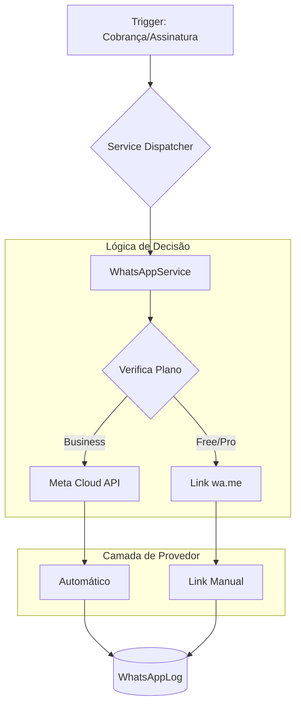

# WhatsApp Integration - Meta Cloud API (Official)

Esta documentação detalha o sistema de integração com WhatsApp do **StreamShare v2**, utilizando a **API Oficial do WhatsApp Business (Meta Cloud API)** e o sistema de fallback manual via links `wa.me`.

---

## 📑 Índice

1. [Visão Geral](#visão-geral)
2. [Arquitetura de Integração](#arquitetura-de-integração)
3. [Lógica de Planos & Automação](#lógica-de-planos--automação)
4. [Configuração do Sistema](#configuração-do-sistema)
5. [Modelos de Dados](#modelos- de-dados)
6. [Templates de Mensagens](#templates-de-mensagens)
7. [Fluxos Principais](#fluxos-principais)
8. [Troubleshooting](#troubleshooting)

---

## Visão Geral

O StreamShare v2 utiliza uma abordagem híbrida para notificações via WhatsApp, garantindo que todos os usuários possam notificar seus clientes, independentemente do plano contratado:

1.  **Envio Automático (Business Plan)**: Disparo direto via **Meta Cloud API**. A mensagem chega ao participante sem intervenção manual.
2.  **Envio Manual (Free/Pro Plans)**: Geração de links `wa.me`. O administrador clica no botão, o WhatsApp Web/App abre com a mensagem pré-preenchida, e o envio é concluído manualmente.

### Características Principais
- ✅ **Oficial**: Integração via API de Nuvem da Meta (v21.0+).
- ✅ **Baseado em Plano**: Automação inteligente detectada pelo `config/plans.ts`.
- ✅ **Anti-Spam**: Bloqueio de reinvio para o mesmo participante em menos de 24h.
- ✅ **Rastreabilidade**: Logs detalhados de sucesso, falha e links gerados.
- ✅ **Flexibilidade**: Configuração de quais tipos de notificação enviar por conta.

---

## Arquitetura de Integração

O sistema é modularizado para separar a lógica de negócio do provedor de mensagens.



### Arquivos Core
- [`src/lib/whatsapp-service.ts`](../../src/lib/whatsapp-service.ts): Orquestrador que decide entre Meta API ou link manual.
- [`src/lib/whatsapp-meta.ts`](../../src/lib/whatsapp-meta.ts): Implementação técnica da Meta Cloud API e normalização E.164.
- [`src/actions/whatsapp.ts`](../../src/actions/whatsapp.ts): Server Actions para gerenciar preferências da conta.

---

## Lógica de Planos & Automação

A automação não depende apenas de configuração, mas do nível de assinatura da **Conta (Tenant)**.

| Plano | Envio Automático | Tipo de Link | Notificações Automatizadas (Cron) |
| :--- | :--- | :--- | :--- |
| **Free** | ❌ Não | `wa.me` (Manual) | ❌ Não |
| **Pro** | ❌ Não | `wa.me` (Manual) | ❌ Não |
| **Business** | ✅ Sim | API Direta | ✅ Sim (Vencimento/Atraso) |

> [!NOTE]
> Para o plano **Business**, o envio automático requer que as variáveis de ambiente globais do sistema estejam configuradas corretamente no servidor.

---

## Configuração do Sistema

Ao contrário da V1 (Twilio), as credenciais da Meta são configuradas **via variáveis de ambiente (`.env`)**, pois são compartilhadas por todo o ecossistema SaaS.

### Variáveis Necessárias (`.env`)
```bash
# Habilita o envio via API (Business Plan)
WHATSAPP_ENABLED="true"

# Credenciais da Meta Cloud API
WHATSAPP_ACCESS_TOKEN="EAAB..."
WHATSAPP_PHONE_NUMBER_ID="1234567890"
WHATSAPP_API_VERSION="v21.0"
```

### Configurações por Conta (UI)
Mesmo com a API configurada, cada administrador decide o que quer notificar em **Configurações > WhatsApp**:
- Ativar/Desativar integração para a conta.
- Habilitar notificações específicas (Nova Assinatura, Cobrança Vencendo, etc.).
- Definir antecedência de aviso (ex: 3 dias antes do vencimento).

---

## Modelos de Dados

### WhatsAppConfig
Define as preferências de notificação de uma conta.
- `contaId`: Vínculo com o tenant.
- `isAtivo`: Master switch para a conta.
- `notificar...`: Toggles booleanos para cada evento.

### WhatsAppLog
O "caixa-preta" das comunicações.
- `enviado`: Boolean indicando se o disparo via API ou geração do link ocorreu.
- `erro`: Descrição técnica se a API da Meta retornou erro.
- `providerId`: ID da mensagem retornado pela Meta (SID).
- `numeroDestino`: Número do participante em formato E.164.

---

## Templates de Mensagens

As mensagens são padronizadas para garantir clareza e profissionalismo. Arquivo: `src/lib/whatsapp-service.ts`.

| Tipo | Gatilho | Exemplo de Conteúdo |
| :--- | :--- | :--- |
| **Nova Assinatura** | Cadastro confirmado | "Olá Mateus! ✨ Sua assinatura de *Netflix* foi confirmada!" |
| **Cobrança Gerada** | Nova fatura aberta | "Olá Mateus! 📝 Nova cobrança gerada para *Netflix*: 💰 R$ 15,90" |
| **Vencendo** | Lembrete (Cron) | "Lembrete: Sua cobrança de *Netflix* vence em 2 dia(s)! ⏰" |
| **Pagamento OK** | Baixa no sistema | "✅ Mateus, pagamento confirmado! *Netflix* - 💰 R$ 15,90" |

---

## Fluxos Principais

### Envio de Notificação Manual (Free/Pro)
1. Administrador clica em **Enviar WhatsApp** na planilha de cobranças.
2. Sistema verifica que o plano é `Pro`.
3. Chama `sendWhatsApp` com `automated: false`.
4. O serviço gera um link `https://wa.me/55...`.
5. Retorna para o frontend o link.
6. O browser abre o link em uma nova aba, pronto para o "Enter" do usuário.

### Envio de Notificação Automática (Business)
1. Mesmo clique (ou disparo automático via Cron Job às 9h).
2. Sistema detecta plano `Business` e `WHATSAPP_ENABLED="true"`.
3. Dispara POST para `graph.facebook.com/v21.0/...`.
4. Registra `messageId` no log após sucesso.

---

## Troubleshooting

### 1. Mensagem de Erro: `account_disabled`
- **Causa**: O administrador não ativou a chave "Ativar Integração" nas configurações da conta.
- **Solução**: Vá em Configurações > WhatsApp e ative a chave.

### 2. Erro no Business: `WHATSAPP_PHONE_NUMBER_ID não configurado`
- **Causa**: O servidor não possui as variáveis de ambiente necessárias.
- **Solução**: Verifique o arquivo `.env` do servidor e garanta que o token e o ID do telefone estão presentes.

### 3. "Já foi enviada uma notificação nas últimas 24h"
- **Causa**: Proteção anti-spam ativa.
- **Solução**: O sistema bloqueia disparos repetitivos para o mesmo tema/participante em curto intervalo. Aguarde o período ou limpe o log se for em ambiente de teste.

### 4. Link `wa.me` com número inválido
- **Causa**: Número do participante não está no formato internacional.
- **Solução**: O sistema tenta normalizar via `toE164`, mas certifique-se de que o número possui DDD (ex: 11999998888).

---
**Última Atualização**: 2026-02-26  
**Status**: Produção (Meta API v21.0)
